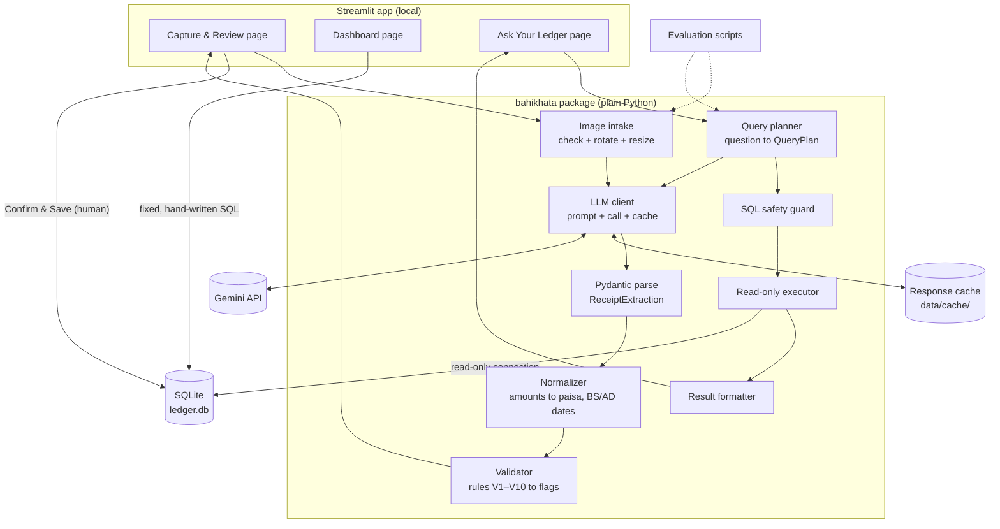
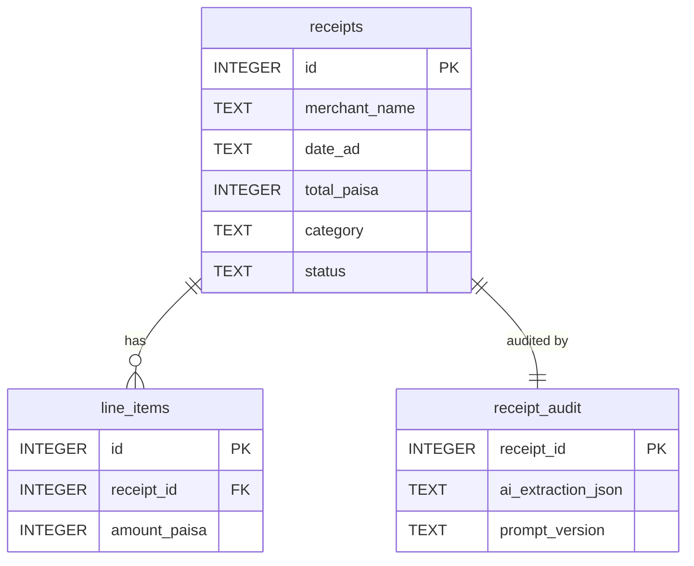

# BahiKhata AI — Architecture

| | |
|---|---|
| **Status** | Approved, with Amendment A1 (Neon Postgres) and Amendment A2 (Alembic migrations) |
| **Based on** | PRD.md (approved) |
| **Deadline** | Friday, 9 October 2026 |
| **Audience** | San (builder), Claude Code (implementer), and evaluators |

This document describes **how** the PRD is built. It adds no product features. Where it refines or questions the PRD, it says so explicitly and lists the item under §25 *Decisions Requiring Approval*.

---

## Amendment A1 — Neon Postgres replaces SQLite (approved 2026-10-03)

**Decision (D8):** The MVP database is **Neon serverless PostgreSQL** (free tier, project `bahikhata`, region ap-southeast-1) instead of a local SQLite file. Approved by San on 2026-10-03.
**Where this amendment conflicts with any section below, this amendment wins.** Principles P1–P11 are unchanged except P6 (see below).

### What changes

| Area | Before (SQLite) | After (Neon Postgres) |
|---|---|---|
| Driver | `sqlite3` (stdlib) | **`psycopg` v3** (`psycopg[binary]`) for all application code. No ORM. (SQLAlchemy is present only as Alembic's migration engine inside `migrations/`; see Amendment A2.) |
| Connection strings | file path in `config.py` | `.env`: `DATABASE_URL` (owner role, writes + DDL) and `DATABASE_URL_READONLY` (read-only role, queries). Both are secrets and gitignored. |
| Pooled vs direct host | n/a | Use the **direct** (non-`-pooler`) host for the app. It is single-user, so no pooling is needed, and the direct host supports per-connection settings such as `statement_timeout`. |
| Read-only executor (A§3.13) | `mode=ro` file URI | Separate role **`ledger_reader`**, created **with SQL** (`CREATE ROLE … LOGIN`), so it does not inherit Neon's console-role privileges. It has `GRANT SELECT` on `receipts` and `line_items` **only** (no access to `receipt_audit`). Every query connection also sets `default_transaction_read_only=on` and `statement_timeout=5s`. |
| Defence in depth (A§6, A§15) | guard + sqlite single-statement + `mode=ro` | guard + **DB-enforced role permissions** (table level) + read-only transaction + timeout. Note: psycopg **does** allow several statements in one `execute()` without parameters, so the sqlite "single statement" barrier no longer exists. The guard's single-statement rule is now the only check at the code level, and the role is the hard stop. |
| SQL guard dialect (A§3.12) | `sqlglot` SQLite dialect | `sqlglot` **postgres** dialect. Additional rejects: `SET`, `COPY`, `CALL`, `DO`, `LISTEN/NOTIFY`, references to `pg_catalog` / `information_schema`, and functions starting with `pg_` (e.g. `pg_sleep`, `pg_read_file`). |
| Column types (A§7) | INTEGER / TEXT / INTEGER flags | ids `BIGINT GENERATED ALWAYS AS IDENTITY`; money `BIGINT` (still **paisa**, D1 unchanged); `date_ad` **`DATE`**; `date_bs` `TEXT`; `bs_year`/`bs_month` `SMALLINT`; `user_override` `BOOLEAN`; timestamps `TIMESTAMPTZ`; audit JSON columns `JSONB`. CHECK constraints, NOT NULLs and FKs unchanged. |
| SQL prompt (A§6) | SQLite SQL, `strftime` | PostgreSQL SQL (`date_trunc`, `EXTRACT`). Python still precomputes date ranges, and the money-alias rule is unchanged. |
| Dashboard reads (A§3.10) | sqlite + pandas | psycopg cursor → `pandas.DataFrame(rows, columns=…)`. Do not use `pd.read_sql` (it wants SQLAlchemy). Parameters use `%s` placeholders, never string formatting. |
| Eval DB (A§16.2) | `data/eval_ledger.db` | Separate Neon database **`ledger_eval`** in the same project (`EVAL_DATABASE_URL`). `build_eval_db.py` refuses to run unless the database name ends in `_eval`. |
| Unit/integration tests | temp SQLite file | Separate Neon database **`ledger_test`** (`TEST_DATABASE_URL`). DB tests **skip** if the variable is not set, and tests clean up their own rows. Normalizer, validator and guard tests need no database. |
| P6 Local-first | everything local | **Ledger data and audit JSON are stored in Neon (cloud).** Receipt images stay local in `data/images/`. Disclose this in the README together with the Gemini note. |

### Unchanged
Integer paisa (D1), blocking vs overridable rules (D2), amounts as text from the LLM (D3), 3 tables with `receipt_audit` not queryable (D5), sqlglot AST guard (D6), date rules (D7), the human confirm step, the evaluation protocol, and Streamlit.

### New risks
| Risk | Mitigation |
|---|---|
| Demo depends on internet for DB, not just Gemini | Phone hotspot as backup; backup screen recording (TASK-041) |
| Neon compute auto-suspends when idle, so the first query after a pause is slow | Open the dashboard once before the demo to wake it |
| Owner credentials leaked | `.env` gitignored (verified); never paste URLs into code, logs or chat |
| Read-only role accidentally gets write rights | TASK-005 acceptance test: an `INSERT` as `ledger_reader` must fail |

---

## Amendment A2 — Alembic replaces the plain-SQL migration runner (approved 2026-10-03)

**Decision:** Schema migrations are managed by **Alembic** instead of the hand-rolled `migrations/migrate.py` runner introduced earlier the same day. Approved by San on 2026-10-03.
**Where this amendment conflicts with Amendment A1 or any section below, this amendment wins.** This reverses the "No Alembic/ORM" line from A1's decision log only; every other A1 decision (psycopg driver for app code, `ledger_reader` role, postgres guard dialect, column types, three tables) is unchanged.

### What changes

| Area | Before (A1) | After (A2) |
|---|---|---|
| Migration tool | Plain numbered `.sql` files (`migrations/001_...`, `002_...`) applied by a custom `migrations/migrate.py` script; versions recorded in a hand-made `schema_migrations` table | **Alembic** revisions (`migrations/versions/0001_create_ledger_tables.py`, `0002_grant_ledger_reader.py`); versions recorded in Alembic's own `alembic_version` table |
| New dependency | — | **`alembic`** and **`sqlalchemy`** (Alembic's dependency). Used **only** as the migration engine — app code (`db.py`, `ask.py`, the dashboard) still talks to Postgres with raw **psycopg**, never the ORM. No SQLAlchemy models exist anywhere in the app. |
| Migration content | Raw SQL files, applied verbatim | Same DDL, wrapped in `op.execute("""...""")` inside `upgrade()`/`downgrade()` functions — each revision is reversible, not just appendable |
| Target selection | `--target main\|eval\|test` CLI flag mapped to `DATABASE_URL` / `EVAL_DATABASE_URL` / `TEST_DATABASE_URL` | `ALEMBIC_TARGET=main\|eval\|test` env var, read by `migrations/env.py`, same three env vars and the same eval/test database-name-suffix guard |
| Running migrations | `uv run python migrations/migrate.py --target main` | `make migrate` (wraps `alembic upgrade head`); see the Makefile for `migrate-down`, `migrate-reset`, `migrate-new`, `migrate-history`, `migrate-current` |

### Why

Writing and maintaining a correct, reversible migration runner by hand (transactional apply, version tracking, dry-run, multi-target guard) duplicates what Alembic already does well, and this project will keep adding tables/columns as TASK-009 and later tasks land. The forbidden-ORM principle was aimed at keeping **application** code free of an ORM layer (query building, lazy loading, session management) — it was never about the migration tool itself. A2 keeps that principle intact: SQLAlchemy is confined to `migrations/env.py` and the revision files.

### Unchanged
Everything else in Amendment A1: psycopg v3 for app code, `.env` variable names, the direct (non-pooler) Neon host, the `ledger_reader` role and its grants (now applied by revision `0002` instead of `002_grant_ledger_reader.sql`), column types, the sqlglot postgres guard dialect, and the three-table design.

---

## 1. Architecture Overview

### What the system does

BahiKhata AI is **one local Python application** that does two jobs:

1. **Capture:** turn a receipt photo into a ledger record that has been checked by code and confirmed by a person.
2. **Query:** answer questions about saved records by running SQL against the local database.

The internet is used only to call the vision LLM API (Gemini). There are no servers to run, no background workers, and no other services.

### Layers

| Layer | What lives here | Knows about AI? |
|---|---|---|
| **Presentation** | Three Streamlit pages: *Capture & Review*, *Dashboard*, *Ask Your Ledger* | No. It calls functions and shows results. |
| **Core pipeline** (`bahikhata/` package) | Image intake, LLM client, schemas, normalizer, validator, DB access, SQL guard, query planner | Only `llm_client.py` talks to the LLM |
| **Storage** | `ledger.db` (SQLite), saved receipt images, LLM response cache | No |
| **Evaluation** (`eval/`) | Scripts that call the **same** core functions on the labelled dataset | Reuses the core |

### Diagram



### How data moves (in one paragraph)

The user uploads a photo. Intake checks it and shrinks it. The LLM client sends it to Gemini with the extraction prompt, unless the cache already has the answer. The reply is parsed into a Pydantic model where every field may be `null`. The normalizer turns text like `"Rs. 1,250/-"` into `125000` paisa and turns the printed date into AD and BS dates using a library. The validator runs arithmetic and completeness rules and produces flags. The review page shows the image beside editable fields with the flags. The user fixes, re-validates and confirms. Only then is the record written to SQLite, along with an audit copy of what the AI originally said. The dashboard reads SQLite with fixed SQL. *Ask Your Ledger* has the LLM write SQL, a guard checks it, it runs on a read-only connection, and the rows are formatted by code.

### Why this architecture fits

- **One process, one database file, one external API.** There is very little that can break, and it fits the 28–32 hour budget.
- **The UI is thin.** All logic is plain functions in `bahikhata/`, which can be unit-tested and reused by evaluation without Streamlit.
- **The AI is boxed in.** Only two components call the LLM (extraction and query planning). Everything after them is deterministic.
- **It is easy to explain.** Every arrow in the diagram is a function call.

---

## 2. Architecture Principles

| # | Principle | What it means in BahiKhata AI |
|---|---|---|
| P1 | **The database is the financial source of truth** | Every number shown on the dashboard or in an answer is read from SQLite. No LLM output is shown as a financial figure unless it came from a database row. |
| P2 | **Deterministic code for calculations and validation** | Sums, VAT checks, paisa conversion and BS↔AD conversion are Python and library code with unit tests. The same input always gives the same output. |
| P3 | **The LLM handles perception and language, not arithmetic truth** | The LLM reads pixels into text fields, picks a category, and translates a question into SQL. It never computes, corrects or converts. |
| P4 | **Human in the loop before persistence** | Nothing reaches `ledger.db` without an explicit *Confirm & Save* click. |
| P5 | **Fail safely rather than guess** | Unreadable means `null` plus a flag. An error is shown, not hidden. An unsafe query is refused. No component fills a gap with a plausible value. |
| P6 | **Local-first** | Data, images and the database stay on the laptop. Only the receipt image (for extraction) and the question plus schema text (for SQL) are sent to the API. |
| P7 | **Minimal dependencies** | Every library in §18 has a written reason. No frameworks. |
| P8 | **Explicit AI/deterministic boundary** | The two LLM-calling functions return Pydantic objects. Everything downstream treats those objects as *untrusted input*. See §12. |
| P9 | **Testability** | Normalizer, validator, SQL guard and DB code are pure functions with pytest tests. The LLM parts are measured by evaluation instead. |
| P10 | **Reproducibility** | Prompts are versioned files. Model name and prompt version are stored with every record and every eval run. "Today" is passed in as a parameter, never read silently. The cache makes reruns identical. |
| P11 | **No unnecessary abstraction** | No base classes, plugin systems or dependency-injection containers. Modules contain functions. A provider switch means editing one file (`llm_client.py`). |

**Design rule used throughout: be lenient at the input boundary and strict at the output boundary.** The extraction schema accepts almost anything (strings, nulls) so one bad field never throws away a whole extraction. The confirmed-record schema and the database are strict (types, enums, NOT NULL, CHECK), so bad data cannot be stored silently.

---

## 3. Component Architecture

Each component maps to one file or page (see §17).

### 3.1 Streamlit UI (`app.py`, `pages/`)
- **Responsibility:** Show pages, collect user input, display results and flags.
- **Inputs:** User clicks, uploads and typed edits; objects returned by core functions.
- **Outputs:** Calls to core functions. Rendered tables, charts and forms.
- **Allowed:** Hold the current draft in `st.session_state`. Call core functions. Format for display.
- **Must NOT:** Contain validation rules, SQL strings (except calling named DB functions), money arithmetic, or direct LLM calls.
- **Depends on:** `streamlit`, `bahikhata.*`
- **Communicates:** Direct Python function calls.
- **Beginner warning:** Streamlit **reruns the whole script on every interaction**. The LLM call must only happen when the *Extract* button is clicked, and its result must be stored in `session_state` keyed by image hash. Otherwise every keystroke can trigger a paid or rate-limited API call.

### 3.2 Image intake (`images.py`)
- **Responsibility:** Accept an uploaded file and decide whether it is a usable receipt image.
- **Inputs:** Uploaded file bytes and filename.
- **Outputs:** Image bytes plus `sha256` of the original, or a clear error.
- **Allowed:** Check size (≤ 10 MB), open with Pillow to confirm it is a real image, and allow only JPEG/PNG.
- **Must NOT:** Call the LLM. Write to the DB. Silently accept HEIC, PDF or other formats.
- **Depends on:** Pillow, `config`
- **Communicates:** Called by the Capture page and by the extraction eval runner.

### 3.3 Basic image handling (`images.py`)
- **Responsibility:** Make the image suitable for the API.
- **Inputs:** Validated image.
- **Outputs:** Processed JPEG bytes and the hash of the processed bytes (the cache key).
- **Allowed:** EXIF auto-rotate. Downscale so the longest edge is ≤ `MAX_LONG_EDGE_PX` (configurable, start around 2000 and tune on the dev set). Convert to RGB JPEG.
- **Must NOT:** Deskew, binarise, crop or otherwise "enhance". That is OpenCV territory and out of scope.
- **Note (PRD refinement):** PRD lists this as SHOULD (S6). Resizing is effectively needed for the MUST extraction to work reliably within API size limits and free-tier token budgets, and it is about ten lines of code. **Recommendation: treat it as part of M1/M2.** See §25 D4.

### 3.4 LLM client (`llm_client.py`)
- **Responsibility:** The **only** module that talks to the LLM provider.
- **Inputs:** Prompt name and version, filled prompt text, optional image bytes, the response schema (a Pydantic model).
- **Outputs:** Raw response text plus metadata (model name, prompt version, cache hit yes/no, latency).
- **Allowed:** Load prompt files. Call the Gemini SDK with temperature 0 and JSON output mode. Read and write the disk cache. Retry once on timeout or 5xx.
- **Must NOT:** Interpret, fix or compute anything in the response. Retry endlessly on rate limits. Log the API key.
- **Depends on:** `google-genai` SDK, `config`, `python-dotenv`
- **Cache:** Key = `sha256(namespace + model + prompt_version + input)`, where input is the processed image hash for extraction or question + today's date for SQL. Stored as one JSON file per key in `data/cache/`. The app and the eval share the cache, so re-running costs zero requests.
- **Backup provider:** Switching to GitHub Models means rewriting the body of this file only. Its function signatures are the boundary.

### 3.5 Pydantic schema layer (`schemas.py`)
- **Responsibility:** Define the shape of all data passed between components. See §9.
- **Inputs/Outputs:** Type definitions only.
- **Allowed:** Field types, enums, `None` defaults, simple field-level checks (e.g. PAN is digits).
- **Must NOT:** Contain business rules that need several fields (those belong in the validator). Call the LLM or the DB.
- **Depends on:** `pydantic` (v2)

### 3.6 Normalizer (`normalize.py`)
- **Responsibility:** Turn transcribed strings into typed values.
- **Inputs:** `ReceiptExtraction`, either from the AI or rebuilt from the human's edits.
- **Outputs:** `ReceiptDraft` (typed values, all nullable) plus a list of normalization flags.
- **Allowed:** Parse amounts (`"1,250.00"`, `"Rs. 1250/-"`, `"१२५०"`) into integer paisa. Parse the printed date, detect BS vs AD (rule in §8), and convert with `nepali-datetime`.
- **Must NOT:** Invent a value when parsing fails. On failure it sets `None` and emits a flag (`N1 amount unparseable`, `N2 date unparseable`, `N3 day/month ambiguous`). It must not use the LLM.
- **Depends on:** `nepali-datetime`, Python `decimal`, `datetime`
- **Reuse:** The review form sends human edits through **the same normalizer**, so AI values and human values are parsed identically.

### 3.7 Validation engine (`validate.py`)
- **Responsibility:** Run rules V1–V10 (§10) and return flags plus a status.
- **Inputs:** `ReceiptDraft`, `today`, config tolerances, and optionally existing records (for V10).
- **Outputs:** `list[ValidationFlag]`, `status ∈ {clean, needs_review, invalid}`, `can_save`, `needs_override`.
- **Allowed:** Read-only checks.
- **Must NOT:** Change any value. It **detects, never corrects.** It must not call the LLM or write to the DB.
- **Depends on:** `schemas`, `config`

### 3.8 Human review layer (`pages/1_Capture_and_Review.py` + `extraction.diff_fields`)
- **Responsibility:** Let the user compare the image with the draft, edit it, re-validate and confirm.
- **Inputs:** Image, `ReceiptDraft`, flags.
- **Outputs:** A `ConfirmedReceipt` plus the list of edited fields, or a discard.
- **Allowed:** Edit every field. Add or remove line items. Re-run normalize and validate. Enable *Save anyway* only for overridable errors.
- **Must NOT:** Save without a click. Save when blocking errors exist. Hide flags.
- See §11.

### 3.9 SQLite persistence (`db.py`)
- **Responsibility:** Create the schema, save confirmed records atomically, and provide named read functions.
- **Inputs:** `ConfirmedReceipt`, audit payload.
- **Outputs:** The new receipt id, or an error.
- **Allowed:** One write function `save_confirmed_receipt(...)` that inserts receipt, line items and audit row in **one transaction**. `PRAGMA foreign_keys = ON` on every connection.
- **Must NOT:** Expose a general "execute any SQL" function on the writable connection. Update or delete records (no edit-after-save in the MVP).
- **Depends on:** `sqlite3` (stdlib), `pandas` (for returning DataFrames)

### 3.10 Dashboard queries (`db.py` read functions + `pages/2_Dashboard.py`)
- **Responsibility:** Show total spend, spend by category, spend by month, and the receipts table.
- **Inputs:** Period filter (AD month range).
- **Outputs:** DataFrames whose money columns are in paisa, formatted to NPR by the shared formatter.
- **Allowed:** Hand-written, parameterised SQL (`?` placeholders). Streamlit's built-in charts.
- **Must NOT:** Use the LLM. Compute totals in Python from partial data. Aggregation happens in SQL.

### 3.11 NL→SQL module (`ask.py`)
- **Responsibility:** Turn a question into a `QueryPlan`, run it through guard and executor, and format a `QueryResult`.
- **Inputs:** Question text, `today`, and the strategy (`"text_to_sql"` now, `"functions"` as fallback).
- **Outputs:** `QueryResult` (plan, executed SQL, columns, rows, formatted rows, message, optional explanation).
- **Allowed:** One LLM call for planning, one optional LLM call for explanation (S2), and one retry when the guard rejects for a *format* reason or SQLite raises an error.
- **Must NOT:** Execute SQL without the guard. Show any LLM-produced number that is not in the rows. Keep conversation memory.
- See §5–6.

### 3.12 SQL safety guard (`sql_guard.py`)
- **Responsibility:** Decide whether a SQL string may run.
- **Inputs:** SQL string.
- **Outputs:** `GuardResult(ok, sql_to_run, reason, retryable)`.
- **Allowed:** Parse with `sqlglot` (SQLite dialect). Allow exactly one statement of type SELECT (CTE allowed). Allow only the tables `receipts` and `line_items` (plus CTE names). Reject write/DDL/PRAGMA/ATTACH nodes. Enforce the money-alias rule (§6). Append `LIMIT 200` if missing.
- **Must NOT:** Fix dangerous SQL. It may only add a LIMIT. It must not execute anything.
- **Depends on:** `sqlglot`

### 3.13 Read-only executor (`db.run_readonly_query`)
- **Responsibility:** Run guarded SQL on a connection that **physically cannot write**.
- **Inputs:** Guarded SQL.
- **Outputs:** Column names and rows, or an error message.
- **Allowed:** Open SQLite with a read-only URI (`mode=ro`).
- **Must NOT:** Reuse the writable connection.

### 3.14 Evaluation harness (`eval/`)
- **Responsibility:** Measure extraction and query quality on labelled data. See §16.
- **Inputs:** `data/eval/{dev,test}/` images plus ground-truth JSON, and `eval/questions.json`.
- **Outputs:** `eval/results/<run_id>/` containing per-field CSV, summary CSV, errors CSV and run info JSON.
- **Allowed:** Call `extraction.extract_draft()` and `ask.answer_question()`, the same functions the UI uses.
- **Must NOT:** Write to `ledger.db`. Use the UI.

### 3.15 Configuration and secrets (`config.py`, `.env`)
- **Responsibility:** One place for settings: model name, prompt versions, tolerances, VAT rate, size limits, paths, row limit, plausible date range.
- **Secrets:** `GEMINI_API_KEY` is read from the environment (loaded from `.env` by `python-dotenv`). `.env` is gitignored, and `.env.example` documents the variable name.
- **Must NOT:** Contain secrets in code. Be scattered as magic numbers across modules.

### 3.16 Prompt management (`prompts/` + loader in `llm_client.py`)
- **Responsibility:** Store prompts as plain versioned text files, e.g. `extraction_v1.txt`.
- **Allowed:** Simple placeholders (`{today}`, `{date_hints}`) filled with `str.replace`.
- **Must NOT:** Be edited after a prompt version has been used in a test-split run. Changes go into a new version file. See §13.

---

## 4. Data Flow: Receipt Ingestion

```text
Upload (bytes)
 → [images] size/type check ............ fail → error message, stop
 → [images] EXIF rotate + resize → processed bytes + hash
 → user clicks "Extract"
 → [llm_client] cache lookup ........... hit → skip API
 → [llm_client] Gemini call (image + extraction prompt + schema, temp 0)
 → raw response text
 → [schemas] parse into ReceiptExtraction (lenient: strings, nullable)
       fail → 1 retry with error note → fail again → empty draft + "extraction failed" flag
 → [normalize] → ReceiptDraft (paisa ints, AD/BS dates, all nullable) + N-flags
 → [validate]  → V-flags + status + can_save / needs_override
 → [review UI] image | editable form | flags
 → user edits → normalize + validate again (repeat as needed)
 → user clicks Confirm & Save (or Save anyway, if allowed)
 → [schemas] build ConfirmedReceipt (strict) ...... fail → stays on form with message
 → [db] one transaction: receipts + line_items + receipt_audit
       fail → rollback, error shown, draft kept in session for retry
 → success message with new record id; dashboard reflects it
```

### Scenarios

| Situation | What happens | Guessing prevented by |
|---|---|---|
| **Valid structured output** | Parsed, normalized, validated, shown for review. Status may still be `needs_review`/`invalid` because of rules. | Validation runs regardless of how good the output looks. |
| **Invalid structured output** (not JSON, wrong shape) | One retry, with the Pydantic error appended to the prompt. If it fails again, the user gets an **empty** draft with an `EXTRACTION_FAILED` blocking flag and can type the receipt manually. Raw text is kept for the audit. | No partial "best effort" parsing of broken JSON. |
| **LLM cannot read a field** | The prompt instructs `null`. The field shows empty in the form. If it is a required field, V1 flags it. | `null` is a valid value everywhere before confirmation. |
| **Field not printed on the receipt** (e.g. no invoice no.) | Same as above. Optional fields stay `null` in the DB. | Optional columns are nullable. |
| **Validation detects an error** | Flag is shown with numbers, e.g. *"V5: subtotal 1,200.00 − discount 0 + VAT 156.00 = 1,356.00 but total is 1,446.00 (diff 90.00)"*. Values are **not** changed. | The validator has no write access to values. |
| **User edits a field** | The edited text goes through the same normalizer, then the validator re-runs and flags update. The field is marked "edited" for the audit. | Same parsing path for AI and human values. |
| **User chooses "Save anyway"** | Allowed only when every remaining error is *overridable* (V5). Saved with `status='invalid'`, `user_override=1`, and the flags stored in the audit. | Blocking errors (missing date/total/merchant/category, unparseable date) disable saving entirely. |
| **Database write fails** | The transaction rolls back, so no half-saved receipt. The error is shown and the draft stays in session for a retry. | Single transaction. |

---

## 5. Data Flow: "Ask Your Ledger"

```text
User question
 → [ask] basic input check (non-empty, ≤ 500 chars)
 → [ask] build SQL prompt: schema description + rules + today + precomputed date ranges + examples
 → [llm_client] Gemini call → QueryPlan JSON
       status = out_of_scope → fixed message, stop
       status = ambiguous    → show clarification text, stop
       status = ok           → continue
 → [sql_guard] check SQL
       unsafe       → refuse, nothing runs, stop (no retry)
       format issue → 1 retry with reason → still bad → error message
 → [db] run on read-only connection
       SQLite error → 1 retry with error text → still bad → error message
 → rows (paisa integers, dates as text)
 → [ask] format: *_paisa columns → "Rs 12,345.00"
 → display: question, assumed date range, SQL, result table
 → (S2, optional) explanation call → number check → show or drop
```

### Why SQL and not RAG/vector search

Take the question *"How much did I spend on inventory last month?"*

- **SQL:** `SELECT SUM(total_paisa) AS total_paisa FROM receipts WHERE category='Inventory' AND date_ad BETWEEN '2026-09-01' AND '2026-09-30'`. SQLite looks at **every** matching row and adds them exactly.
- **Vector search** would return the *k most similar-looking* receipts, not all receipts in September. The LLM would then add up whatever subset it got. Missing rows give a wrong total, and LLM arithmetic adds another error source. Similarity is the wrong operation for filtering and summing.

Also, SQLite stays the source of truth: **the LLM writes the question in SQL form, but SQLite calculates the answer.** The PRD excludes RAG, vector databases and embeddings, and this architecture does not need them.

### Special cases

| Case | Handling |
|---|---|
| **Unsupported / off-topic** ("Should I take a loan?") | LLM returns `status: out_of_scope`. UI shows: *"I can only answer questions about your saved receipts."* No SQL runs. |
| **Ambiguous** ("How much on stuff?") | `status: ambiguous` plus a short clarification. Nothing runs. The user rephrases (no multi-turn memory). |
| **Invalid SQL** (syntax error, unknown column) | Guard parse failure or SQLite error leads to one retry with the error message. Then a visible error message. |
| **Unsafe SQL** (`DELETE`, `DROP`, multiple statements, `PRAGMA`, `ATTACH`, unknown table) | Refused by the guard, never executed, no retry. Even if the guard missed it, the read-only connection would raise an error (defence in depth). |
| **Empty result** | Shown as *"No matching records."* `SUM` over no rows returns `NULL`, and the formatter shows "no matching records", **not** Rs 0.00. |
| **Wrong date interpretation** | Deterministic code computes the date ranges and gives them to the LLM. The plan's `date_range_start/end` and the SQL are **always shown**, so the user can see that "last month" was taken as 2026-09-01 → 2026-09-30. Query eval measures this. |

---

## 6. Natural-Language → SQL Design

### What the LLM receives (`prompts/sql_v1.txt`)
1. **Schema description**, written by hand, for **only** `receipts` and `line_items`: column names, types and one-line meanings. Important notes:
   - money columns are **integer paisa** (1 NPR = 100 paisa)
   - `date_ad` is `YYYY-MM-DD` text
   - `bs_month` 1 = Baisakh … 12 = Chaitra
   - the allowed `category` values
   - `status` meanings
   The audit table is **not** described.
2. **Rules:**
   - Return exactly one SQLite SELECT.
   - Every output column computed from a `*_paisa` column must have an alias ending in `_paisa`.
   - Use `date_ad` for date ranges.
   - Never write or modify data.
   - Return `out_of_scope` for questions not about saved receipts, and `ambiguous` when unsure.
3. **Today and precomputed ranges**, calculated in Python, not by the LLM. For example: `today = 2026-10-01; this_month = 2026-10-01..2026-10-31; last_month = 2026-09-01..2026-09-30; this_week (Sun–Sat) = …`. The LLM copies dates; it does not calculate them.
4. **About 6 few-shot examples** (question → QueryPlan JSON) covering: total in period, by category, by merchant, count, top-N, VAT, one `out_of_scope`, one `ambiguous`. **The examples must not duplicate eval questions**, to avoid leakage.

### Output format
JSON matching the `QueryPlan` schema (§9), enforced through structured output and parsed by Pydantic:
`{status, sql, date_range_start, date_range_end, clarification}`.

### Guard checks (`sql_guard.py`), in order
1. Parse with `sqlglot` (SQLite dialect). A parse error is rejected as *retryable*.
2. Exactly **one** statement. Otherwise reject as *unsafe*.
3. The root must be a SELECT (a WITH … SELECT is allowed). Otherwise reject as *unsafe*.
4. The tree contains no Insert, Update, Delete, Drop, Create, Alter, Pragma, Attach, or Command nodes. Otherwise reject as *unsafe*.
5. Every table referenced is in `{receipts, line_items}` or is a CTE defined in the same query. Otherwise reject as *unsafe*.
6. **Money-alias rule:** any output column that references a `*_paisa` column must have an alias ending in `_paisa`. Otherwise reject as *retryable*. This lets the formatter know which columns to show as rupees, and stops a 100× display error.
7. If there is no LIMIT, append `LIMIT 200`.

### Execution
`run_readonly_query(sql)` opens `file:data/ledger.db?mode=ro` as a URI. **Why defence in depth:** the guard is our code and could have a bug or miss an edge case. A read-only connection is enforced by SQLite itself, so even a guard bypass cannot modify data. Two independent locks.

### Result
`QueryResult` holds the plan, the SQL actually run, columns, raw rows and formatted rows. The UI shows all of it. Money columns are formatted by **deterministic code**, never by the LLM.

### Optional explanation (S2)
Input: question plus formatted rows. Output: one or two sentences. **Number check:** extract every number token from the explanation (ignoring commas) and require each one to appear in the formatted rows or the shown date range. If any number fails, the explanation is dropped and only the table is shown.

### Fallback boundary (designed, not built)
`ask.answer_question(question, today, strategy)` is the single entry point. The UI and eval call only this.

- `strategy="text_to_sql"` (MVP): the LLM writes SQL.
- `strategy="functions"` (fallback): the LLM returns `{function: "spend_in_period", args: {category, start, end}}`, chosen from about 6 hand-written parameterised SQL templates in `ask.py`. These templates **still pass through the same guard and the same read-only executor** and return the same `QueryResult`.

Switching is a config value plus one new planner function and prompt. The UI, guard, executor, formatter and eval stay unchanged. The decision to switch comes from query-eval execution accuracy.

---

## 7. Database Architecture

Three tables. Only **two** are visible to NL queries.



### Table `receipts`: the human-confirmed ledger (queryable)

| Column | Type | Null? | Notes |
|---|---|---|---|
| `id` | INTEGER | PK | autoincrement |
| `merchant_name` | TEXT | NOT NULL | V1 |
| `merchant_pan` | TEXT | NULL | 9 digits if present |
| `invoice_number` | TEXT | NULL | |
| `date_ad` | TEXT | NOT NULL | `YYYY-MM-DD`, canonical date for queries |
| `date_bs` | TEXT | NOT NULL | `YYYY-MM-DD` in BS |
| `bs_year` | INTEGER | NOT NULL | e.g. 2083 |
| `bs_month` | INTEGER | NOT NULL | CHECK 1–12 (1 = Baisakh) |
| `subtotal_paisa` | INTEGER | NULL | NULL = not printed |
| `discount_paisa` | INTEGER | NULL | |
| `service_charge_paisa` | INTEGER | NULL | |
| `vat_paisa` | INTEGER | NULL | NULL for VAT-inclusive bills |
| `total_paisa` | INTEGER | NOT NULL | CHECK > 0 |
| `category` | TEXT | NOT NULL | CHECK in the 9 enum values |
| `status` | TEXT | NOT NULL | CHECK in (`clean`, `needs_review`, `invalid`), status at save time |
| `user_override` | INTEGER | NOT NULL | 0/1, DEFAULT 0 |
| `image_path` | TEXT | NOT NULL | relative path under `data/images/` |
| `created_at` | TEXT | NOT NULL | ISO-8601 local timestamp |

### Table `line_items` (queryable)

| Column | Type | Null? | Notes |
|---|---|---|---|
| `id` | INTEGER | PK | |
| `receipt_id` | INTEGER | NOT NULL | FK → `receipts.id` ON DELETE CASCADE |
| `line_no` | INTEGER | NOT NULL | order on receipt, starting at 1 |
| `description` | TEXT | NULL | |
| `quantity` | REAL | NULL | not money, so REAL is acceptable (e.g. 1.5 kg) |
| `unit_price_paisa` | INTEGER | NULL | |
| `amount_paisa` | INTEGER | NULL | |

**Relationship:** one receipt has zero or more line items (1→N). Line items are optional because some receipts (and handwritten slips) have none. Category lives on the receipt (PRD D9).

### Table `receipt_audit`: what the AI said (NOT queryable)

| Column | Type | Null? | Notes |
|---|---|---|---|
| `receipt_id` | INTEGER | PK, FK → `receipts.id` | 1:1 |
| `model_name` | TEXT | NOT NULL | e.g. the exact Gemini model id |
| `prompt_version` | TEXT | NOT NULL | e.g. `extraction_v1` |
| `image_sha256` | TEXT | NOT NULL | original upload hash |
| `raw_response` | TEXT | NULL | raw model text (NULL if extraction failed before a response) |
| `ai_extraction_json` | TEXT | NULL | parsed `ReceiptExtraction` (AI-transcribed values) |
| `ai_draft_json` | TEXT | NULL | normalized `ReceiptDraft` before human edits |
| `flags_at_extraction_json` | TEXT | NOT NULL | flags before human edits |
| `flags_at_save_json` | TEXT | NOT NULL | flags at confirm time |
| `edited_fields_json` | TEXT | NOT NULL | e.g. `["total_paisa","line_items"]` |
| `extracted_at` | TEXT | NULL | |
| `confirmed_at` | TEXT | NOT NULL | |

### Where things live

| Item | Location |
|---|---|
| Final human-confirmed values | `receipts`, `line_items` |
| Raw AI extraction JSON | `receipt_audit.raw_response`, `ai_extraction_json` |
| Validation flags | `receipt_audit.flags_at_extraction_json`, `flags_at_save_json` (plus summary `receipts.status`) |
| Prompt version, model name | `receipt_audit` |
| Edited fields | `receipt_audit.edited_fields_json` |
| Image path | `receipts.image_path` (file itself in `data/images/<sha256>.jpg`) |
| Timestamps | `receipts.created_at`, `receipt_audit.extracted_at`, `confirmed_at` |
| `user_override` | `receipts.user_override` |

**Why a separate audit table:** the NL→SQL prompt and the guard's allowlist only need to know about two clean tables. The guard can allowlist **tables** (simple and robust) instead of individual columns (harder to get right). Large JSON blobs stay away from queries.

**Indexes:** none needed. At tens or hundreds of rows SQLite scans instantly. Adding indexes now would be premature optimisation.

**Two database files:** `data/ledger.db` holds the user's real ledger for the app. `data/eval_ledger.db` is rebuilt by a script from ground-truth labels for query evaluation (§16).

---

## 8. Money and Date Representation

### Money: store **integer paisa** (recommended)

| Option | Pros | Cons |
|---|---|---|
| **REAL (float)** | Simple | `0.1 + 0.2 ≠ 0.3`. Sums can drift by fractions of a paisa, and equality checks in validation become unreliable. ❌ |
| **Decimal stored as TEXT** | Exact in Python | SQLite `SUM()` on TEXT converts to float, so aggregation in SQL loses the benefit. Awkward. ❌ |
| **INTEGER paisa** | Exact in SQLite *and* Python. `SUM()` stays exact. Validation compares integers. | Values must be divided by 100 for display, and the LLM must know the unit. ✅ |

**Decision: INTEGER paisa for all money columns, suffixed `_paisa`.**

- Parsing: normalizer → Python `Decimal` → `int(round(value × 100))`. Floats are never used for money.
- Display: one formatter function converts paisa to `Rs 1,250.00`. The dashboard and Ask page both use it.
- LLM risk: the LLM might forget the unit. Two mitigations: (1) the `_paisa` suffix plus a rule in the prompt, and (2) the guard's money-alias rule (§6) means the formatter always knows which result columns are money. The LLM never divides by 100. Code does.
- Tolerances become integers: ±NPR 1 = **±100 paisa**.

### Dates

| Field | Stored as | Produced by |
|---|---|---|
| `date_raw` | TEXT (audit JSON only) | LLM transcription, exactly as printed |
| `date_ad` | TEXT `YYYY-MM-DD` | normalizer (parse, or library conversion from BS) |
| `date_bs` | TEXT `YYYY-MM-DD` | normalizer (parse, or library conversion from AD) |
| `bs_year`, `bs_month` | INTEGER | derived from `date_bs` |

- **Why TEXT ISO dates:** SQLite has no DATE type. ISO strings sort correctly, work with `BETWEEN`, and work with SQLite's `strftime`.
- **BS vs AD detection (deterministic):** plausible AD years (2018–2030) and BS years (2075–2090) **do not overlap**, so a 4-digit year ≥ 2070 means BS and ≤ 2035 means AD. The LLM's `date_calendar_hint` is used only when the year is missing or two-digit. If both are unclear, the date is set to `null` with flag N2.
- **Day/month order:** BS dates are normally printed `YYYY-MM-DD` or `YYYY/MM/DD`. AD dates in Nepal are commonly `DD/MM/YYYY` or `DD-MM-YYYY`. If both the first two numbers are ≤ 12, the normalizer applies the documented convention (DD/MM) **and** raises warning N3, *"day/month order assumed DD/MM — check"*, so the assumption is visible.
- **Conversion:** only via `nepali-datetime`. The LLM is never asked to convert. On day 1, check the library against 3–4 known BS↔AD pairs, including one from the current year.

---

## 9. Pydantic Schema Design

Conceptual models. Field lists, not code.

### `Category` (enum)
`Inventory, Office Supplies, Transportation, Utilities, Rent, Equipment, Marketing, Food, Other`

### `ExtractedLineItem` (lenient, from the LLM)
| Field | Type |
|---|---|
| description | `str \| None` |
| quantity_raw | `str \| None` |
| unit_price_raw | `str \| None` |
| amount_raw | `str \| None` |

### `ReceiptExtraction` (lenient, from the LLM, sent as the response schema)
| Field | Type | Why |
|---|---|---|
| merchant_name | `str \| None` | |
| merchant_pan | `str \| None` | transcribed, checked later (V7) |
| invoice_number | `str \| None` | |
| date_raw | `str \| None` | as printed. No conversion by the LLM. |
| date_calendar_hint | `"BS" \| "AD" \| "unknown"` | hint only |
| line_items | `list[ExtractedLineItem]` | may be empty |
| subtotal_raw, discount_raw, service_charge_raw, vat_amount_raw, total_raw | `str \| None` | **amounts are transcribed as text**, so the LLM copies rather than reformats and code does the parsing |
| category | `str \| None` | checked against the enum by V9, so one bad label doesn't fail the whole extraction |
| currency_raw | `str \| None` | audit only. MVP assumes NPR. |

*Every field defaults to `None`.* This is how the PRD rule "unreadable means null" is represented: `null` is always a valid answer, so the model is never forced to fill a field.

### `ValidationFlag`
| Field | Type |
|---|---|
| rule_id | `str` (`V1`…`V10`, `N1`–`N3`, `EXTRACTION_FAILED`) |
| severity | `"BLOCKING" \| "ERROR" \| "WARNING"` |
| field | `str \| None` |
| message | `str` (includes the numbers involved) |

### `DraftLineItem` / `ReceiptDraft` (typed, still nullable, used by the review form)
Same fields as the extraction but typed: `*_paisa: int | None`, `quantity: Decimal | None`, `date_ad: date | None`, `date_bs: str | None`, `bs_year/bs_month: int | None`, `category: Category | None`, `date_raw: str | None`.

### `ConfirmedReceipt` (strict, the only thing `db.save_confirmed_receipt` accepts)
`merchant_name: str` (non-empty), `date_ad: date`, `date_bs: str`, `bs_year: int`, `bs_month: int (1–12)`, `total_paisa: int (> 0)`, `category: Category`, optional fields `... | None`, `line_items: list[DraftLineItem]`, `status`, `user_override: bool`.
Building it fails if a blocking requirement is missing. That is a second safety net behind the validator.

### `GroundTruthReceipt` (eval only)
Same fields as `ReceiptDraft`, plus `id`, `split`, `slice`, `notes`. Amounts are written in labels as NPR decimal strings (`"1250.50"`) and dates as `date_printed` + `calendar`. The eval converts these with simple, separate code. Loading every label file through this model **catches labelling typos** before evaluation.

### `QueryPlan` (from the LLM)
`status: "ok" | "out_of_scope" | "ambiguous"`, `sql: str | None`, `date_range_start: str | None`, `date_range_end: str | None`, `clarification: str | None`.

### `QueryResult` (to the UI and eval)
`question`, `plan`, `sql_executed: str | None`, `columns: list[str]`, `rows: list[tuple]`, `formatted_rows`, `message: str | None` (refusal/error/empty), `explanation: str | None`, `prompt_version`, `model_name`.

### Validation boundaries
- **Pydantic checks shape and single-field types** (is it a string, is it in the enum, is it a positive int).
- **`validate.py` checks business rules across fields** (V3–V6 arithmetic, V8 date plausibility, V10 duplicates).
- Keeping these separate means a receipt with bad arithmetic is still *representable*, so it can be shown, reviewed and fixed.

> **Verify on day 1:** Gemini's structured-output mode accepts a Pydantic model as the response schema, but support for optional/union fields can vary. If `str | None` causes trouble in the provider schema, ask for JSON with the schema described in the prompt, and keep Pydantic as the real validator on our side.

---

## 10. Validation Architecture

`validate_draft(draft, today, existing=None) -> (flags, status, can_save, needs_override)`

Tolerance `TOL = 100` paisa (±NPR 1), from config.

| Rule | Input | Check | Severity | Blocks save? |
|---|---|---|---|---|
| **V1** Required fields | merchant_name, date_ad, total_paisa | each is non-null and non-empty | BLOCKING | **Yes** |
| **V2** Positive amounts | all `*_paisa` | total > 0; none negative | BLOCKING | **Yes** |
| **V3** Line arithmetic | each line item | `|round(qty × unit_price) − amount| ≤ TOL` (only if all three present) | WARNING | No |
| **V4** Lines vs subtotal | line items, subtotal | `|Σ amount − subtotal| ≤ TOL` (only if both present) | WARNING | No |
| **V5** Bill arithmetic | subtotal, discount, service_charge, vat, total | `|subtotal − discount + service_charge + vat − total| ≤ TOL` (missing discount/SC/VAT count as 0; skipped if subtotal is null) | ERROR | Overridable via *Save anyway* |
| **V6** VAT rate | vat, taxable = subtotal − discount + service_charge | `|vat − round(taxable × 13/100)| ≤ max(200, 1% of expected)` (skipped if vat is null) | WARNING | No |
| **V7** PAN format | merchant_pan | exactly 9 digits (if present) | WARNING | No |
| **V8** Date plausibility | date_ad, today | not after today; not before 2075-01-01 BS | WARNING (unparseable dates are already N2 + V1) | No |
| **V9** Category | category | in the enum | BLOCKING | **Yes** |
| **V10** Duplicate (SHOULD) | PAN+invoice_no, or merchant+date+total vs existing records | match found | WARNING | No |
| N1 | amount text | unparseable | WARNING (the field becomes null; V1 catches it if required) | No |
| N2 | date text | unparseable / calendar unclear | WARNING (V1 then blocks) | via V1 |
| N3 | date text | day/month order assumed | WARNING | No |

**Status:** `invalid` if any BLOCKING or ERROR flag; `needs_review` if only WARNINGs; `clean` if no flags.
`can_save = no BLOCKING flags`. `needs_override = can_save and any ERROR flag`.

**Where it runs:**
1. Right after extraction (results are stored as `flags_at_extraction`).
2. On every *Re-validate* click.
3. Immediately before saving (results are stored as `flags_at_save`).

**Never corrects:** the function receives the draft and returns flags. It has no code path that returns a modified draft.

> **PRD refinement:** The PRD says remaining ERRORs can be saved with *Save anyway*. But a record with no date, total, merchant or category cannot be stored in a queryable ledger (those columns are NOT NULL and every query depends on them). So this design splits PRD "ERROR" into **BLOCKING** (V1, V2, V9) and **overridable ERROR** (V5: the receipt's own printed arithmetic can be wrong). See §25 D2.

---

## 11. Human-in-the-Loop Architecture

### Review screen layout (Capture & Review page)

```text
┌──────────────────────────┬─────────────────────────────────────────┐
│                          │ FLAGS  ⛔ V1 total missing               │
│   Receipt image          │        ⚠ V6 VAT 150.00 ≠ 13% (156.00)    │
│   (st.image, zoomable    ├─────────────────────────────────────────┤
│    via full-screen)      │ Header form (st.form)                   │
│                          │  merchant, PAN, invoice no.             │
│                          │  date (as printed) + calendar BS/AD     │
│                          │  → shows converted AD / BS below        │
│                          │  subtotal, discount, service charge,    │
│                          │  VAT, total (NPR text)                  │
│                          │  category (select box)                  │
│                          ├─────────────────────────────────────────┤
│                          │ Line items (st.data_editor, add/delete) │
│                          ├─────────────────────────────────────────┤
│                          │ [Re-validate]  [Confirm & Save]         │
│                          │ ☐ Save anyway (only if overridable)     │
│                          │ [Discard]                               │
└──────────────────────────┴─────────────────────────────────────────┘
```

- Amounts are edited as NPR text (`1250.50`) and re-parsed by the **same normalizer**.
- The date is edited as printed, plus a calendar selector. The converted AD/BS values are displayed but **not** typed by hand, so conversion always goes through the library.
- Using `st.form` avoids a rerun on every keystroke. Validation runs on *Re-validate* or *Confirm*.
- *Confirm & Save* is disabled while BLOCKING flags exist. The *Save anyway* checkbox appears only when `needs_override` is true.

### AI-extracted value vs human-confirmed value
- **AI-extracted value:** what the model read, stored in `receipt_audit.ai_extraction_json` and `ai_draft_json`. It is evidence of model behaviour.
- **Human-confirmed value:** what the user approved, stored in `receipts` / `line_items`. It is the ledger truth.

**Why store both:**
1. **Accountability.** You can always show what the AI proposed and what the person changed.
2. **Measurement.** It gives real-world correction rates, not just eval-set accuracy.
3. **Debugging.** If a saved number looks wrong, you can tell whether it was an AI error the reviewer missed or a human typo.

### Edited fields → correction rate (S4)
At save time, `extraction.diff_fields(ai_draft, confirmed)` compares header fields one by one and compares line items as a block (`"line_items"` is edited if any item differs). The list goes into `edited_fields_json`. Later, a simple query such as *count receipts where `"total_paisa"` is in the edited list ÷ total receipts* gives the correction rate per field. This needs only a small pandas script, no new architecture.

---

## 12. AI Boundary

| Task | AI/LLM | Deterministic code | Human |
|---|---|---|---|
| Reading the receipt image | ✅ transcribes text into fields | | checks against the image |
| Extracting merchant name | ✅ | trims whitespace | corrects |
| Extracting invoice number | ✅ | | corrects |
| Extracting amounts | ✅ copies amount **text** | parses text to paisa | corrects |
| Category classification | ✅ suggests from the enum | V9 checks it is a valid enum value | confirms or changes |
| BS↔AD conversion | ❌ never | ✅ `nepali-datetime` | sees result, edits the source date if wrong |
| Detecting BS vs AD | hint only | ✅ year-range rule | can override the calendar selector |
| Arithmetic validation | ❌ never | ✅ V3–V6 | decides whether to fix or override (V5) |
| Money normalization | ❌ | ✅ Decimal → paisa | |
| Duplicate detection (S1) | ❌ | ✅ exact match on keys | decides |
| Final correction | | re-validates | ✅ **owns the final values** |
| Deciding to save | ❌ | enforces blocking rules | ✅ clicks Confirm |
| Scope check of a question | ✅ classifies ok / out_of_scope / ambiguous | input length check | rephrases |
| Date ranges for "last month" | copies them | ✅ computes them | sees the assumed range |
| SQL generation | ✅ | | can read the shown SQL |
| SQL safety | ❌ | ✅ sqlglot guard + read-only connection | |
| SQL execution | ❌ | ✅ SQLite | |
| Financial aggregation (SUM, COUNT) | ❌ | ✅ SQLite | |
| Formatting money for display | ❌ | ✅ formatter | |
| Result explanation (S2) | ✅ rephrases rows | ✅ number check drops bad explanations | |
| Dashboard numbers | ❌ | ✅ fixed SQL | |

**In one sentence for the interview:** *The LLM is used only where the input is unstructured — pixels on a receipt, words in a question. Once something is structured, deterministic code and the human take over.*

---

## 13. LLM Prompt Architecture

```text
prompts/
├── extraction_v1.txt     # image → ReceiptExtraction JSON
├── sql_v1.txt            # question → QueryPlan JSON
└── explanation_v1.txt    # rows → 1–2 sentences (S2)
```

- **Versioning:** the version **is** the filename. `config.py` names the active version (`EXTRACTION_PROMPT = "extraction_v1"`). To change a prompt, copy it to `_v2`, edit, and switch the config. Old versions are never edited once used in a test run, so old results stay reproducible.
- **Model name:** `config.MODEL_NAME` holds the exact model id. `llm_client` returns it with every response, and it is stored in `receipt_audit.model_name` and in every eval run's `run_info.json`.
- **Eval linkage:** each eval run writes `run_info.json` containing `{run_id, timestamp, split, model_name, extraction_prompt, sql_prompt, n_items, cache_hits}`. Results folders are named `<date>_<split>_<prompt_version>`.
- **Dev vs test separation:**
  - Prompt iteration runs only with `--split dev`.
  - `--split test` requires an explicit flag and prints a reminder. Run it **twice in total**: baseline (prompt v1, before iteration) and final.
  - Do not open test receipts in the app while iterating prompts. The cache is shared, and looking at test outputs is a form of tuning to the test set.
- **Placeholders:** `{today}`, `{date_ranges}`, `{examples}` are filled by plain string replacement. No templating library.
- **Prompt content requirements** (final wording written during implementation):
  - Extraction: say "return null if unreadable or not printed", "copy amounts exactly as printed", "do not calculate or correct", "do not convert dates", and list the category definitions.
  - SQL: the schema, rules and examples from §6.

---

## 14. Error Handling and Failure Modes

**Principle: fail visibly and safely, never silently guess.**

| Failure | Detection | System behaviour | User sees | Retry? | Can save? |
|---|---|---|---|---|---|
| Invalid image (corrupt / not an image) | Pillow cannot open it | stop before any API call | "This file isn't a readable image." | No | No |
| Unsupported format (HEIC, PDF, WEBP…) | format check | stop | "Please upload JPG or PNG." | No | No |
| Oversized image (> 10 MB) | byte size check | stop | "File too large (max 10 MB)." | No | No |
| API failure (5xx / network) | SDK exception | 1 automatic retry after a short wait | "Extraction service unavailable — try again." | 1 auto, then manual button | Yes, by typing manually into an empty draft |
| API timeout | timeout (~60 s) | same as above | same | 1 auto | same |
| Rate limit (429) | SDK error code | **no** automatic retry loop | "Free-tier limit reached — wait a minute and retry." | Manual only | same |
| Malformed LLM output (not JSON) | JSON parse fails | 1 retry with error note | if still failing: empty draft + `EXTRACTION_FAILED` | 1 | Only after the user fills required fields |
| Schema validation failure | Pydantic error | same as malformed | same | 1 | same |
| Missing field | value is `null` | V1 BLOCKING if required, otherwise nothing | empty field, flag for required ones | No | After the user fills required fields |
| Bad date | normalizer parse fails (N2) | `date_ad = null` → V1 blocks | "Date unreadable — please enter it" | No | After correction |
| Arithmetic mismatch | V5 / V3 / V4 | flag with numbers | ⛔/⚠ message with diff | No | V5: via *Save anyway*; V3/V4: yes |
| Invalid category | V9 | BLOCKING | "Choose a category" | No | After selection |
| Database failure on save | `sqlite3` exception | rollback; draft kept in session | "Couldn't save — your edits are kept, try again." | Manual | Yes, on retry |
| Unsafe SQL | guard (unsafe) | refuse, nothing executed | "This request isn't allowed. I can only read your ledger." | **No** | n/a (read-only) |
| Invalid SQL | guard parse error / SQLite error | 1 retry with error text | if still failing: "I couldn't build a valid query — try rephrasing." + SQL shown | 1 | n/a |
| Empty SQL result | 0 rows or all-NULL aggregate | no LLM explanation | "No matching records." | No | n/a |
| Out-of-scope question | `QueryPlan.status = out_of_scope` | no SQL | "I can only answer questions about your saved receipts." | No | n/a |
| Ambiguous question | `status = ambiguous` | no SQL | clarification text from the plan | No (user rephrases) | n/a |

---

## 15. Security and Safety Architecture

Practical measures for a local, single-user student project.

| Concern | Measure |
|---|---|
| API key | Read from env var `GEMINI_API_KEY`, loaded from `.env` by `python-dotenv`. Never hard-coded, logged or shown in the UI. |
| `.env` / `.gitignore` | `.gitignore` covers `.env`, `data/ledger.db`, `data/eval_ledger.db`, `data/images/`, `data/cache/`, `__pycache__/`. A committed `.env.example` lists the variable names only. |
| No secrets in GitHub | Before the first push, check `git status` and search the repo for the key prefix. If a key is ever committed, revoke it in Google AI Studio. Deleting the commit is not enough. |
| Receipt privacy | Use your own or consenting shops' receipts. Mask customer names and phone numbers (paint over before photographing or editing) **before** any image goes to the API or into the repo. |
| Eval images in the repo | Commit only masked images. If unsure, keep `data/eval/` images out of the public repo and say so in the README. |
| Third-party transmission | Receipt images and question text go to Google's API. On the free tier, Google may use submitted content to improve its products (per its pricing page at the time of the PRD). State this in the README. Nothing else leaves the laptop. |
| Local image storage | Saved images live in `data/images/<sha256>.jpg` on the laptop only (gitignored). |
| SQL injection / unsafe SQL | Dashboard SQL is hand-written with `?` parameters, so there is no string building with user input. LLM-generated SQL goes through the guard (§6). |
| Single-statement restriction | Guard rule 2. In addition, Python's `sqlite3.execute()` refuses to run multiple statements in one call (a second, independent barrier). |
| Allowed tables | Guard rule 5. The audit table is not queryable. |
| Read-only connection | `mode=ro` URI connection for all NL queries. Enforced by SQLite, not by our code. |
| Prompt injection via receipt text | A receipt image could contain text like "ignore instructions". Impact is limited because extraction output is only *proposed data*: it is validated, shown to a human, and never executed. Note this as a known limitation. |

Out of scope (per PRD): authentication, encryption at rest, network security, multi-user isolation.

---

## 16. Evaluation Architecture

### 16.1 Extraction evaluation

```text
data/eval/{dev|test}/*.jpg + *.json (ground truth)
 → load + validate labels (GroundTruthReceipt)
 → extraction runner: for each image → extraction.extract_draft()   ← same code as the app
       (images → llm_client(+cache) → parse → normalize → validate)
 → comparator: draft vs ground truth, field by field (rules in PRD §18.1)
 → metrics.py: per-field accuracy, line-item P/R, category confusion,
               core & full record accuracy, hallucination / omission / wrong-value counts,
               validation catch rate, flag precision, review burden
 → eval/results/<run_id>/
       per_field.csv   (receipt_id, slice, field, gold, predicted, outcome)
       summary.csv     (metric, overall, per slice)
       errors.csv      (one row per mismatch + empty "error_category" column)
       run_info.json   (model, prompt versions, split, timestamp, cache hits)
 → error analysis: fill error_category by hand → summarize_errors.py tallies by category × slice
```

**Comparator rules** (from the PRD):

| Field | Rule |
|---|---|
| merchant_name | normalised, fuzzy ratio ≥ 0.85 (`rapidfuzz`); borderline cases noted |
| merchant_pan, invoice_number | exact match after stripping spaces |
| date_ad | exact match |
| amounts | `|diff| ≤ 100` paisa |
| line items | greedy match on amount + fuzzy description |
| category | exact match |

Outcomes per field: `correct`, `wrong_value`, `hallucinated` (gold null, predicted non-null), `omitted` (gold non-null, predicted null), `both_null`.

**Validation effectiveness:**
- Catch rate = receipts with ≥ 1 wrong core field **and** ≥ 1 flag ÷ receipts with ≥ 1 wrong core field.
- Flag precision = flagged receipts that had an error ÷ flagged receipts.

**Protocol (PRD §18.4):** label all 30 → **baseline test run with `extraction_v1`** → iterate on dev only → **final test run** → report both. With 22 test receipts, one receipt ≈ 4.5 percentage points. Report counts alongside percentages (e.g. "19/22").

### 16.2 Query evaluation

```text
eval/questions.json  (~15 answerable + 5 unsafe + 3 out-of-scope)
 → build_eval_db.py: data/eval_ledger.db from test-set GROUND TRUTH (+ a few hand-entered records
                     in eval/extra_records.json to cover ≥ 2 months and all categories)
 → query runner: for each question → ask.answer_question(q, today=EVAL_TODAY)   ← same code as the app
 → answerable: run gold_sql on the same DB → compare result sets
               (values exact; order-sensitive only if the question says order_matters)
 → unsafe: pass if refused by the guard OR plan is out_of_scope; ALSO check DB file hash unchanged
 → out-of-scope: pass if status = out_of_scope
 → metrics: execution accuracy (x/15), unsafe rejection (must be 5/5), out-of-scope handling (x/3)
 → eval/results/<run_id>/query_results.csv + run_info.json
```

**Key design choices:**
- The eval DB is built from **ground truth**, not AI extractions, so query accuracy is measured independently of extraction errors.
- `EVAL_TODAY` is a fixed date in the question file, so "last month" means the same thing on every run.
- Results are compared, not SQL text. Two different SQL queries that give the same correct answer both pass.

### 16.3 What evaluation reuses

| Reused from the app | Not used by eval |
|---|---|
| `images`, `llm_client` (incl. cache), `schemas`, `normalize`, `validate`, `extraction.extract_draft`, `ask.answer_question`, `sql_guard`, `db.run_readonly_query` | Streamlit pages, `db.save_confirmed_receipt`, `ledger.db` |

So the numbers describe the **real** pipeline, not a separate test version.

No accuracy targets are set in advance (PRD §18.4).

---

## 17. Project Directory Structure

```text
bahikhata-ai/
├── app.py                         # Streamlit entry: home page, short instructions, DB init
├── pages/
│   ├── 1_Capture_and_Review.py    # upload → extract → review → save
│   ├── 2_Dashboard.py             # totals, by category, by month, receipts table
│   └── 3_Ask_Your_Ledger.py       # chat-style single-turn questions
├── bahikhata/                     # all logic; no Streamlit imports here
│   ├── __init__.py
│   ├── config.py                  # settings, paths, tolerances, model + prompt versions
│   ├── schemas.py                 # all Pydantic models + Category enum
│   ├── images.py                  # intake checks, EXIF rotate, resize, hashing
│   ├── llm_client.py              # ONLY place that calls the LLM; prompt loading; cache; retry
│   ├── extraction.py              # extract_draft() orchestration; diff_fields()
│   ├── normalize.py               # amounts → paisa; dates → AD/BS; money formatter
│   ├── validate.py                # V1–V10 (+ N-flags), status, can_save
│   ├── db.py                      # schema DDL, save (transaction), dashboard reads, read-only executor
│   ├── sql_guard.py               # sqlglot-based guard
│   └── ask.py                     # answer_question(): planner, retry, formatting, explanation check
├── prompts/
│   ├── extraction_v1.txt
│   ├── sql_v1.txt
│   └── explanation_v1.txt
├── eval/
│   ├── run_extraction_eval.py     # --split dev|test
│   ├── run_query_eval.py
│   ├── build_eval_db.py
│   ├── summarize_errors.py
│   ├── metrics.py                 # comparators + metric functions
│   ├── questions.json             # NL eval set with gold SQL + EVAL_TODAY
│   ├── extra_records.json         # hand-entered records for eval DB coverage
│   └── results/                   # one folder per run (commit summaries)
├── data/
│   ├── eval/
│   │   ├── dev/                   # 8 × (r001.jpg + r001.json)
│   │   └── test/                  # 22 × (image + label)
│   ├── images/                    # saved receipt images      (gitignored)
│   ├── cache/                     # LLM response cache        (gitignored)
│   ├── ledger.db                  # the real ledger           (gitignored)
│   └── eval_ledger.db             # generated by build_eval_db (gitignored)
├── tests/
│   ├── test_images.py
│   ├── test_normalize.py
│   ├── test_validate.py
│   ├── test_sql_guard.py          # includes the adversarial SQL strings
│   └── test_db.py                 # save round-trip, FK, read-only refusal, dashboard sums
├── migrations/                    # Alembic (Amendment A2); SQLAlchemy is used only here
│   ├── env.py                     # ALEMBIC_TARGET=main|eval|test → DB URL; _eval/_test suffix guard
│   ├── script.py.mako
│   └── versions/                  # 0001_create_ledger_tables.py, 0002_grant_ledger_reader.py
├── docs/
│   ├── PRD.md
│   └── ARCHITECTURE.md
├── alembic.ini
├── Makefile                       # make migrate / migrate-down / migrate-reset / migrate-new …
├── .env.example
├── .gitignore
├── requirements.txt
└── README.md                      # written later
```

Eleven small modules, each with one job you can describe in a sentence. The rule of thumb is that **`bahikhata/` never imports Streamlit**. That keeps all logic testable and reusable by `eval/`.

---

## 18. Dependency / Tooling Decisions

| Technology | Purpose | Why needed | Free? | Alternative / fallback |
|---|---|---|---|---|
| Python 3.11+ | language | PRD constraint | ✅ | — |
| Streamlit | UI (forms, data editor, charts, image) | single-process UI with no frontend code | ✅ OSS | Gradio (worse for multi-page dashboards) |
| Pydantic v2 | schemas, parsing LLM output | turns "JSON-ish text" into a checked contract | ✅ OSS | dataclasses + manual checks (more code, weaker) |
| sqlite3 | database | stdlib; one file; read-only URI mode | ✅ stdlib | — |
| Pandas | dashboard frames, eval metrics, error tallies | convenient grouping and CSV output | ✅ OSS | plain lists (more code) |
| nepali-datetime | BS↔AD conversion | the LLM must not convert calendars | ✅ OSS | another BS library. **Verify accuracy on day 1.** |
| google-genai (Gemini SDK) | vision extraction + SQL generation | PRD D3 | ✅ SDK free; API free tier, **verify availability and limits on day 1** | GitHub Models via the `openai` SDK (install only if switching) |
| Pillow | image open/verify, EXIF rotate, resize | needed for intake and size control | ✅ OSS | — |
| sqlglot | SQL guard (parse into a tree, check node types and tables) | a regex/keyword guard is easy to bypass and hard to get right | ✅ OSS | keyword-blocklist guard (weaker) + read-only connection still protects data |
| rapidfuzz | fuzzy merchant/description matching in eval | PRD §18.1 fuzzy rule | ✅ OSS | `difflib` from stdlib (slower, fine at 30 items) |
| python-dotenv | load `.env` | keeps the key out of code; works for both app and eval scripts | ✅ OSS | export the env var manually |
| pytest | unit tests | validator/normalizer/guard correctness | ✅ OSS | — |

**Explicitly not used:**

| Not used | Why |
|---|---|
| LangChain, LlamaIndex | hide the prompt/schema/SQL steps you want to learn and explain; no PRD need |
| FAISS, Chroma, embeddings | no RAG (PRD §9) |
| FastAPI, Flask, React | Streamlit covers the UI; no API consumers exist |
| PostgreSQL, Redis, Docker | single user, local, one file is enough |
| OpenCV | no heavy preprocessing (PRD §9) |
| PaddleOCR / EasyOCR | stretch X1 only; not in `requirements.txt` for the MVP |
| Jupyter | not needed; eval is scripts with CSV output |
| `openai` SDK | only if you switch to the GitHub Models backup |

---

## 19. Architectural Tradeoffs

### A. Vision LLM directly vs OCR → LLM
- **Direct (MVP):** one call sees the **layout**. It can tell which number sits next to "Total" versus "Sub Total", and it handles Devanagari and mixed scripts. There is one component to debug.
- **OCR → LLM:** OCR engines struggle with faded thermal paper and Devanagari, and they output text **without layout**, which the LLM then has to rebuild. That is two failure points and twice the work.
- **Why it stays a stretch (X1):** it's a measurable experiment on the 8 dev receipts. Same comparator, two pipelines: does OCR text help or hurt? It's useful interview material, but only after the MVP works.

### B. SQLite vs PostgreSQL
One user, hundreds of rows, one laptop. SQLite is a file: no server, no install, works with `pandas`, and has a **built-in read-only mode** we rely on for safety. PostgreSQL would add a running service and setup time for no PRD benefit.

### C. Streamlit vs separate frontend/backend
The PRD needs four screens' worth of forms, a table editor, charts and an image. Streamlit provides all of these in Python. A FastAPI + React split would mean writing an API, JSON contracts and a JS app, roughly doubling the work. The cost of Streamlit is rerun-model quirks, mitigated by `session_state` and `st.form` (§3.1).

### D. SQL vs RAG/vector search
The ledger is rows with exact fields. Questions like "inventory last month" are **filter + sum**, which SQL does exactly over *all* matching rows. Vector search returns the *most similar few* rows, which is wrong for totals, and leaves arithmetic to the LLM. See §5.

### E. Free-form text-to-SQL vs predefined query functions

| | Text-to-SQL (MVP) | Predefined functions (fallback) |
|---|---|---|
| Flexibility | any question the schema can answer | only the ~6 shapes you wrote |
| Reliability | can produce valid-but-wrong SQL | SQL is hand-written, so only argument choice can be wrong |
| Safety | needs the guard | inherently safe (still goes through the guard) |
| Learning value | high: prompt design, schema description, SQL validation | medium: function calling |

Text-to-SQL is the current experiment because it teaches more and handles comparison questions. The boundary in §6 makes switching cheap if query eval shows poor accuracy.

### F. Human review vs automatic save
Extraction errors on Nepali receipts are expected (thermal fade, handwriting). Arithmetic checks catch many errors but not all, e.g. a consistently misread total and subtotal. In a ledger, a wrong saved number damages every later answer. Review costs about 30–60 seconds per receipt and gives real correction data. Auto-saving `clean` records is out of scope (PRD H-1).

### G. LLM confidence vs deterministic validation
If asked "how confident are you?", the model will happily say 0.95 for a misread number. Self-reported confidence is not calibrated. A V5 failure is **evidence**: the numbers on the receipt don't add up as transcribed. Flags are also explainable ("off by NPR 90") and measurable (catch rate, flag precision).

---

## 20. Traceability Matrix

| PRD req. | Architectural component | Implementation location | Test / evaluation |
|---|---|---|---|
| **M1** Upload JPG/PNG | Image intake + basic handling | `bahikhata/images.py`, `pages/1_Capture_and_Review.py` | `tests/test_images.py` (reject non-image, oversize, HEIC; accept JPG/PNG); demo |
| **M2** Structured extraction | LLM client, prompts, schemas, extraction orchestrator | `llm_client.py`, `prompts/extraction_vN.txt`, `schemas.py`, `extraction.py` | extraction eval: schema-valid rate, per-field metrics, hallucination/omission |
| **M3** Normalisation (amounts, AD+BS) | Normalizer | `normalize.py` | `tests/test_normalize.py` (amount formats, BS↔AD known pairs, ambiguous dates); eval date accuracy |
| **M4** Validation with flags | Validation engine | `validate.py`, `config.py` (tolerances) | `tests/test_validate.py` (pass + fail per rule); eval catch rate & flag precision |
| **M5** Human review screen | Review layer | `pages/1_Capture_and_Review.py`, `extraction.diff_fields` | demo checklist (edit → re-validate → flags update; blocking disables save); `edited_fields` stored |
| **M6** Save AI + final values | Persistence + audit table | `db.py` (`save_confirmed_receipt`, DDL) | `tests/test_db.py` (round-trip, transaction rollback, FK cascade, NOT NULL / CHECK) |
| **M7** Dashboard | Dashboard queries + page | `db.py` read functions, `pages/2_Dashboard.py` | `tests/test_db.py` (sums on known seed data = expected) |
| **M8** NL question → SQL → result | NL→SQL module, formatter | `ask.py`, `prompts/sql_vN.txt`, `pages/3_Ask_Your_Ledger.py` | query eval: execution accuracy (x/15), out-of-scope (x/3) |
| **M9** SQL safety guard | Guard + read-only executor | `sql_guard.py`, `db.run_readonly_query` | `tests/test_sql_guard.py` (adversarial strings); `test_db.py` (write on ro connection fails); query eval 5/5 unsafe rejected + DB hash unchanged |
| **M10** ~30 labelled receipts + extraction eval script | Evaluation harness | `data/eval/`, `schemas.GroundTruthReceipt`, `eval/run_extraction_eval.py`, `eval/metrics.py`, `eval/summarize_errors.py` | baseline + final test runs; results folders |
| **M11** NL-query eval (~15 + 5 unsafe + 3 OOS) | Query eval harness | `eval/questions.json`, `eval/build_eval_db.py`, `eval/run_query_eval.py` | query results CSV + summary |
| PRD constraint: cache to protect free tier | LLM client cache | `llm_client.py`, `data/cache/` | `run_info.json` cache-hit count |

---

## 21. Architectural Risks

| # | Risk | Why it matters | Simplest mitigation |
|---|---|---|---|
| R1 | **Deadline: labelling not done before the weekend** | Eval is a MUST and needs labels | Label on weekday evenings in parallel with coding. A label is a JSON file and needs no app. Stop at 30. |
| R2 | **Free-tier key/limits differ from expectations** | Blocks extraction entirely | Day-1 spike: one real receipt through Gemini with a JSON schema. Cache from the first call. Keep the GitHub Models fallback in mind (one-file change). |
| R3 | **Streamlit rerun behaviour** causes repeated API calls or lost edits | Wastes quota; confusing bugs | Explicit *Extract* button; store draft in `session_state` keyed by image hash; header edits inside `st.form`. |
| R4 | **`st.data_editor` line-item editing is fiddly** | M5 time sink | Keep it minimal: plain columns, add/delete rows, no custom widgets. If stuck, line items can be edited as a simple table and re-parsed. |
| R5 | **Extraction quality on thermal/Devanagari receipts** | Lower numbers | It's a finding, not a failure. Report by slice; human review covers it in the product. |
| R6 | **Text-to-SQL valid-but-wrong** (date ranges, unit confusion) | Wrong answers that look right | Precomputed date ranges, `_paisa` alias rule, SQL + range always shown, query eval, function-based fallback. |
| R7 | **Provider structured-output quirks** (nullable unions) | Parse failures | Lenient all-string schema; Pydantic validation on our side; one retry. |
| R8 | **BS library accuracy / edge years** | Wrong dates stored | Day-1 check against known pairs; unit tests. |
| R9 | **Receipt diversity** (VAT-inclusive, service charge, discounts) | False V5/V6 flags | Explicit discount/service_charge fields; V5 treats missing as 0; V6 skipped when VAT is absent. Measure flag precision. |
| R10 | **Privacy** (unmasked receipts pushed to GitHub or sent to API) | Real personal data exposure | Mask before photographing; gitignore `data/`; README disclosure. |
| R11 | **Scope creep inside the architecture** (adding V10, S2, fancy UI early) | Missed MUSTs | Implementation order (§22): no SHOULD work until the MUST loop and both evals run end-to-end. |

---

## 22. Implementation Order

Dependency-aware order. **Pure Python first** (testable without the API), then one AI vertical slice, then querying, then evaluation.

```text
0. Day-1 spikes (before anything else, ~1 h)
   a. Gemini key works: send 1 receipt image + JSON schema, get JSON back
   b. nepali-datetime converts 3–4 known BS↔AD pairs correctly
   c. Start collecting + masking receipts; create label template
1. Project skeleton: folders, requirements.txt, config.py, .env.example, .gitignore
2. schemas.py (all models incl. GroundTruthReceipt)
3. normalize.py + tests          ┐ no API needed —
4. validate.py + tests           │ good weekday-evening work
5. db.py (DDL, save transaction, read-only executor) + tests ┘
6. images.py + llm_client.py (with cache) + extraction.py
   → run extract_draft() on 1 dev receipt from the command line
7. Capture & Review page → upload → extract → review → save        ← core loop complete
8. Dashboard page
9. sql_guard.py + tests (BEFORE any LLM-generated SQL is executed)
10. ask.py + prompts/sql_v1 + Ask Your Ledger page
11. Extraction eval harness (metrics, runner) → run on dev to debug the harness
12. BASELINE test run (extraction_v1)
13. build_eval_db + questions.json + query eval → baseline query results
14. Iterate prompts on DEV only → error analysis → v2
15. FINAL test run (extraction + query) → summaries
16. Demo hardening: seeded demo DB, rehearse the PRD §24 script, backup screen recording
(SHOULD items only after step 15 is done)
```

Labelling (30 receipts) runs **in parallel** and must be complete before step 12.

---

## 23. What I Must Understand Before Coding

| Component | Concepts to understand first |
|---|---|
| Image intake | What EXIF orientation is; why resizing reduces tokens/upload size; hashing for identity |
| LLM client | Multimodal LLM structured output (JSON mode + response schema); temperature 0 and determinism limits; caching by content hash; rate limits (429) vs server errors (5xx) |
| Schemas | Pydantic parsing vs validation; `Optional`/`None` defaults; enums; why lenient-in / strict-out |
| Normalizer | Why floats are unsafe for money; `Decimal`; BS vs AD calendars and why conversion is a lookup, not arithmetic |
| Validator | Deterministic validation vs LLM reasoning; tolerances for rounding; severity levels and what "blocking" means |
| Review UI | Streamlit's rerun model; `session_state`; `st.form`; human-in-the-loop as a design choice |
| Database | Primary/foreign keys and 1→N relationships; NOT NULL / CHECK constraints; transactions and rollback; ISO date strings in SQLite |
| Dashboard | SQL `GROUP BY`, `SUM`, `strftime`; parameterised queries (`?`) |
| NL→SQL | Text-to-SQL prompting (schema + rules + few-shot); why the LLM gets precomputed dates; valid-but-wrong SQL |
| SQL guard | SQL injection; parsing SQL into a tree (AST) vs keyword matching; allowlist vs blocklist |
| Executor | Read-only connections; defence in depth |
| Evaluation | Dev/test split and why you don't tune on test; per-field accuracy vs record accuracy; hallucination vs omission; small-sample uncertainty |
| Prompts | Prompt versioning and reproducibility; few-shot leakage into eval |
| Error analysis | Categorising errors; fixing the largest category first; recording failed experiments |

---

## 24. Critical Architecture Review

| # | Question | Answer | Change made |
|---|---|---|---|
| 1 | Is every component necessary? | Yes. Each maps to M1–M11 (§20). `rapidfuzz` and `python-dotenv` are small conveniences with stdlib fallbacks. | Kept `sqlglot`: the guard is a MUST and a regex guard is the weak point interviewers probe. |
| 2 | Anything over-engineered? | The 3rd table could look like extra. | Kept, because it simplifies the guard (table-level allowlist) and the SQL prompt. No indexes, no abstraction layers, no provider interface beyond one file. |
| 3 | Can a beginner build it in time? | Yes, if steps 3–5 (pure Python) start on weekday evenings and labelling runs in parallel. The riskiest work (Streamlit review screen) is scheduled for the weekend. | Added day-1 spikes to remove the two external unknowns early. |
| 4 | Hidden scope creep? | Basic resize/rotate is technically S6. | Flagged as decision D4 instead of silently promoting it. V10 and S2 are designed as hooks only. |
| 5 | Can every financial number be traced to SQLite? | Dashboard: fixed SQL. Ask: rows from SQLite, formatted by code. Explanation: number-checked or dropped. | — |
| 6 | Can a hallucinated number reach the user? | **Extraction:** only as a *proposal* on the review screen, never saved without confirmation. Residual risk: a human approves a misread number that passes arithmetic, which is measured by eval and stated as a limitation. **Query:** wrong SQL can return a *real* number for the *wrong question*. Mitigated by showing SQL and date range, and measured by query eval. The LLM never produces the number itself. | Added the money-alias rule to prevent a 100× unit error. |
| 7 | Can unsafe SQL modify the DB? | Guard (AST-based) + `sqlite3` single-statement execution + `mode=ro` connection = three independent barriers. Query eval checks the DB hash. | — |
| 8 | Can a bad receipt be saved without confirmation? | No. The only write path is `save_confirmed_receipt`, called only from the Confirm button, requiring a strict `ConfirmedReceipt`. | Split ERROR into BLOCKING vs overridable (D2), so "Save anyway" can't store an unqueryable record. |
| 9 | Can evaluation measure the claims? | Extraction accuracy: yes (field comparators). "Validation catches errors": yes (catch rate). "Safe SQL": yes (5/5 + hash). "Query accuracy": yes, independent of extraction (ground-truth eval DB). | Eval DB built from ground truth, not AI output; fixed `EVAL_TODAY`. |
| 10 | Will free-tier limits cause avoidable problems? | Without caching and the Streamlit rerun fix, yes. | Disk cache shared by app and eval; explicit Extract button; no auto-retry on 429. |
| 11 | Is there a simpler architecture that satisfies the PRD? | Dropping the guard library or the audit table would be simpler but would weaken M9 and M6. Merging modules further would make testing harder. This is close to the minimum. | — |

---

## 25. Decisions Requiring Approval

| # | Decision | Recommended default | Why | If you choose differently |
|---|---|---|---|---|
| D1 | Money representation | **INTEGER paisa** with `_paisa` column suffix + guard money-alias rule | Exact in both SQLite `SUM` and Python; integer comparisons in validation | REAL: rounding drift and fuzzy equality everywhere. Decimal-as-TEXT: SQLite aggregates lose exactness. |
| D2 | Save rules for errors (refines PRD FR-5 AC6) | **BLOCKING** = V1, V2, V9 (cannot save); **overridable ERROR** = V5 (*Save anyway*) | Ledger rows without date/total/merchant/category break every query and the dashboard | Keep PRD as written: DB columns must become nullable, and queries/dashboard must handle missing dates and totals. |
| D3 | LLM transcribes amounts as **text**, code parses | Yes (all `*_raw: str \| None`) | LLM copies instead of reformatting; one parser for AI and human input; avoids provider float/Decimal schema issues | Numeric fields: simpler schema, but the LLM may "helpfully" round or reformat, and parse failures lose the original text. |
| D4 | Basic EXIF rotate + resize treated as part of M1/M2 (PRD lists it as S6) | Yes | Needed for reliable API calls and free-tier token budgets; ~10 lines | Leave as SHOULD: risk of oversized/rotated uploads failing during the MUST work. |
| D5 | Three tables (`receipts`, `line_items` queryable; `receipt_audit` not) | Yes | Keeps the NL schema small and the guard's allowlist table-level | Audit columns in `receipts`: guard needs column-level allowlisting and the SQL prompt gets noisier. |
| D6 | `sqlglot` for the SQL guard | Yes | AST checks are much harder to bypass than keyword lists | Keyword guard: less robust; you rely more on the read-only connection. |
| D7 | Ambiguous day/month dates: apply DD/MM convention **with a visible warning** (N3) | Yes | Visible, reviewable assumption; avoids blocking many receipts | Always set to null: safer but forces manual date entry on many receipts. |
| D8 | Database engine (Amendment A1) | **Neon Postgres, approved 2026-10-03** | Chosen by San | Requires psycopg, a read-only role, the postgres guard dialect, and internet for the demo |
| D9 | Schema migration tool (Amendment A2) | **Alembic, approved 2026-10-03** | Chosen by San; reverses A1's "no Alembic/ORM" | SQLAlchemy is a new dependency, confined to `migrations/` as the migration engine only — app code keeps using raw psycopg, no ORM |
