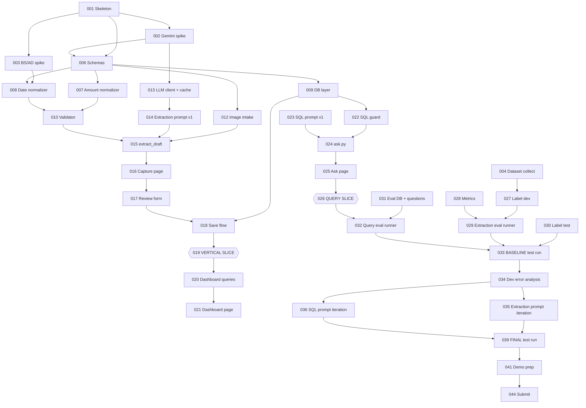

# BahiKhata AI — TASKS.md

| | |
|---|---|
| **Status** | Execution plan v1 |
| **Source of truth** | `PRD.md` (scope), `ARCHITECTURE.md` (design). This file only schedules them. |
| **Today** | Thursday, 1 October 2026 |
| **Hard deadline** | Friday, 9 October 2026 (submission/demo; buffer only) |
| **Rule** | If a task here seems to conflict with PRD/ARCHITECTURE, the documents win. Stop and raise it. |

Section references like *A§6* point to ARCHITECTURE.md and *PRD§15* to PRD.md.

---

## 0. Conflicts and Gaps Found (need your approval)

Comparing the task brief against PRD and ARCHITECTURE turned up these items. **None is silently resolved.**

| # | Issue | PRD / ARCH says | Brief says | Recommendation |
|---|---|---|---|---|
| C1 | **Duplicate detection** | SHOULD (PRD S1, A§10 V10) | Listed under "current validation design" and unit tests | Keep as **P1** (TASK-051). Do not build before the cut line. |
| C2 | **"Category normalization"** | V9 only checks the value against the enum; the normalizer does no category mapping (A§3.6) | Unit tests for category normalization | Treat as **V9 tests only**. Optional tiny change: trim whitespace + case-insensitive match to the enum (e.g. `"inventory"` → `Inventory`). That is a small normalizer addition, so it needs approval first. |
| C3 | **No dev split for query questions** | PRD/A§16: ~15 questions + 5 unsafe + 3 out-of-scope, no dev/test split | "Do not tune prompts against the test set" | Add **~5 extra dev questions** (`questions_dev.json`) for SQL prompt iteration. Keep the 15/5/3 as the test set. This adds a data file, not a feature. |
| C4 | **Architecture decisions D1–D7** | Listed under A§25 as "requiring approval" | Brief calls the architecture "approved" and restates D1, D2, D3 as fixed | This plan **assumes D1–D7 are all approved**, including D4 (resize in MVP), D5 (3 tables), D6 (sqlglot) and D7 (DD/MM + warning). Confirm. |
| C5 | **Baseline test run timing** | PRD§18.4 / A§16: baseline test run with prompt v1 **before** dev iteration | Day plan puts extraction eval Tue, iteration Wed, final Thu | Baseline test run is scheduled **Tue, before any prompt change** (TASK-033). It counts as test run 1 of 2. |

---

### Amendment A1 (2026-10-03): Neon Postgres replaces SQLite
See ARCHITECTURE.md "Amendment A1". Impact on this plan:
- **New TASK-005** (Neon setup + read-only role + connectivity check), first thing Saturday, ~45 m.
- TASK-009, TASK-020, TASK-022, TASK-031 and the DB tests follow A1 (psycopg, `ledger_reader` role, postgres dialect, `ledger_eval` / `ledger_test` databases).
- Wherever a task below says "SQLite", read "Neon Postgres" and follow A1's table.
- Saturday gains ~45 m of work. If behind, use Saturday's existing fallbacks; do not skip the read-only role.

### Amendment A2 (2026-10-03): Alembic replaces the plain-SQL migration runner
See ARCHITECTURE.md "Amendment A2". Impact on this plan:
- `migrations/migrate.py` and the numbered `.sql` files from A1 are replaced by Alembic revisions under `migrations/versions/`, run via `make migrate` / `make migrate-reset` (Makefile at repo root).
- TASK-009's "applies the `ledger_reader` grants after creating tables" step is now revision `0002_grant_ledger_reader.py`, not `002_grant_ledger_reader.sql`.
- New dependencies: `alembic`, `sqlalchemy` (Alembic's engine only — §14 "Forbidden for MVP" still bars an ORM in application code; see the updated line there).

## 1. Time Budget

| Day | Date | Available (assumed) | Planned load |
|---|---|---|---|
| Thu | Oct 1 | ~2.5 h evening | 2.5 h |
| Fri | Oct 2 | ~2.5 h evening | 2.5 h |
| Sat | Oct 3 | ~9 h | ~8.5 h |
| Sun | Oct 4 | ~9 h | ~8.5 h (incl. 1.5 h labelling) |
| Mon | Oct 5 | ~2.5 h | 2.5 h |
| Tue | Oct 6 | ~2.5 h | 2.5 h |
| Wed | Oct 7 | ~2.5 h | 2.5 h |
| Thu | Oct 8 | ~2.5 h | 2.5 h |
| Fri | Oct 9 | ~1–2 h | verification + submission only |
| **Total** | | **~35 h** | **~32 h planned, ~10% slack** |

**Reality check:** this plan is achievable only if the vertical slice works by Saturday night. Weekday evenings fit about 2–3 small tasks each. Tasks marked ⏱ often overrun.

---

## 2. Work Tracks (what can run in parallel)

| Track | Content | Blocks critical path? |
|---|---|---|
| **A — Core pipeline** | schemas, normalize, validate, db, images, llm_client, extraction | Yes |
| **B — UI** | Capture & Review, Dashboard, Ask pages | Yes (review page) |
| **C — Query** | sql_guard, ask, SQL prompt | Yes |
| **D — Dataset** | collect, mask, label 30 receipts | Only blocks evaluation (Tue). **Must not block the vertical slice.** |
| **E — Evaluation** | metrics, runners, eval DB, questions | Blocks Tue–Thu |
| **F — Tests & hygiene** | unit/integration tests, security sweep | Written alongside each module |

Track D runs in short sessions on Thu, Fri and Sat morning, plus Sun and Mon blocks. Writing the query questions (Track E) can happen any time after the DB schema is fixed (Fri).

---

## 3. Task Dependency Graph



---

## 4. Critical Path

The smallest chain that must succeed for the MVP to exist:

```text
001 Skeleton
 → 002 Gemini spike
 → 006 Schemas
 → 007 + 008 Normalizer (amounts, dates)
 → 010 Validator
 → 013 LLM client + cache → 014 Extraction prompt v1
 → 015 extract_draft (CLI, 1 receipt)
 → 016 Capture page → 017 Review form → 018 Save flow   [009 DB layer joins here]
 → 019 VERTICAL SLICE ✔ (Sat night)
 → 022 SQL guard → 024 ask.py → 025 Ask page
 → 026 QUERY SLICE ✔ (Sun night)
 → 029 Extraction eval runner + 032 Query eval runner   [027/030 labels join here]
 → 033 Baseline test run (Tue)
 → 035/036 Dev iteration (Wed)
 → 039 Final test run (Thu)
 → 041 Demo prep → 044 Submit
```

The dashboard (020/021) is required but **not** on the critical path. It is simple, fixed-SQL work that can slip a few hours without blocking anything.

### Critical-path risks

| Risk | Why it matters | When to test | Fallback (already allowed by ARCH) |
|---|---|---|---|
| **Gemini key / free tier / image input** | No extraction means no product | **Thu, TASK-002** (first hour) | GitHub Models via `openai` SDK: rewrite `llm_client.py` body only (A§3.4) |
| **Structured output with nullable fields** | Parse failures on every call | Thu, TASK-002 | Ask for JSON with the schema described in the prompt; Pydantic still validates on our side (A§9 note) |
| **Nepali / Devanagari / thermal quality** | Low accuracy | Sat, TASK-015 on 2–3 varied dev receipts | Not a blocker. Report it by slice; human review covers it. |
| **Normalization edge cases** (`Rs.1250/-`, Devanagari digits, `1,25,000`) | Wrong paisa values | Fri/Sat unit tests | Parser returns `None` + N1 flag; human enters the value |
| **BS↔AD library accuracy** | Wrong dates stored | **Thu, TASK-003** | A different BS library (same role, A§18); worst case, the human enters the AD date |
| **Streamlit review UX** (reruns, `data_editor`) ⏱ | Slice not done Saturday | Sat afternoon | Plain form, line items as a basic editable table, no styling (A§21 R4) |
| **SQLite schema mistakes** | Painful mid-week migrations | Fri, TASK-009 tests | No migrations: delete `ledger.db` and recreate it. Fine before demo data exists. |
| **Text-to-SQL correctness** | Wrong answers | Sun TASK-026, measured Tue | Predefined query functions behind the same `answer_question()` boundary (A§6) |
| **SQL safety** | Data modification or embarrassment in demo | Sun, TASK-022 (before any LLM SQL runs) | The read-only connection still blocks writes even if the guard has a bug |
| **Evaluation dataset quality/size** | Weak evaluation | Labelling Sat–Mon | Smaller but diverse set (see §11 Fallbacks) |
| **Weekday time** | Evening tasks spill over | Every evening checkpoint | Follow the day's fallback; never steal from the next day's critical-path task to add features |

---

## 5. First Vertical Slice

**Target: end of Saturday, 3 October.**

```text
receipt image (dev receipt)
 → images.py (check, rotate, resize, hash)
 → llm_client (Gemini, cached)
 → ReceiptExtraction (Pydantic)
 → normalize → ReceiptDraft
 → validate → flags + status
 → Streamlit review: image | editable form | flags
 → Confirm & Save
 → SQLite: receipts + line_items + receipt_audit
 → visible when reading the DB back
```

**Tasks required:** 001, 002, 006, 007, 008, 009, 010, 012, 013, 014, 015, 016, 017, 018, 019.

**What counts as "working":**
1. Upload one real dev receipt, click *Extract*, and see pre-filled fields within a reasonable time.
2. Flags are shown with numbers in the message.
3. Change a value; *Re-validate* updates the flags.
4. A missing total (cleared by hand) disables *Confirm & Save*.
5. A V5 mismatch shows *Save anyway*; using it stores `user_override=1, status='invalid'`.
6. After saving, `sqlite3 data/ledger.db "select ..."` shows the receipt, its line items and an audit row containing AI JSON plus `edited_fields_json`.
7. Reloading the page **does not** call the API again (cache hit / session state).

**Intentionally unfinished at this point:** dashboard, Ask Your Ledger, evaluation, prompt tuning, styling, duplicate detection, explanation, multi-receipt handling.

---

## 6. Daily Plan with Checkpoints

### Thursday, Oct 1 — Spikes and skeleton (~2.5 h)

| Task | Time |
|---|---|
| TASK-001 Skeleton + secrets hygiene | 30 m |
| TASK-002 Gemini multimodal spike | 60 m |
| TASK-003 nepali-datetime spike | 20 m |
| TASK-004 Start dataset collection + masking + label template | 30 m |

**Expected output:** repo runs `streamlit run app.py` (empty page). One receipt has returned JSON from Gemini. BS↔AD conversion is verified. A receipt pile and naming scheme exist.

**End-of-Thu checkpoint:**
- [ ] I have seen real JSON from Gemini for one real receipt.
- [ ] I know whether `str | None` fields work in the provider schema (recorded in §16 Spike Log).
- [ ] `nepali-datetime` converted 3–4 known dates correctly.
- [ ] `.env` is gitignored and the key is not in any committed file.

**If behind:** TASK-002 and TASK-003 are non-negotiable tonight. Skeleton polish and dataset labelling can move to Friday. **If Gemini fails entirely:** spend Friday's first hour on the GitHub Models spike instead of TASK-006.

### Friday, Oct 2 — Foundations without the API (~2.5 h)

| Task | Time |
|---|---|
| TASK-006 Pydantic schemas | 45 m |
| TASK-007 Amount normalizer + tests | 45 m |
| TASK-008 Date normalizer + tests ⏱ | 45 m |
| TASK-009 DB layer (DDL + save transaction + read-only executor) + tests | 30 m (start; finish Sat) |

**Parallel (10–15 min breaks):** keep collecting/masking receipts.

**End-of-Fri checkpoint:**
- [ ] `pytest` passes for amount parsing (≥ 8 formats) and dates (BS, AD, ambiguous, garbage).
- [ ] All models in `schemas.py` import and round-trip a sample dict.
- [ ] DB DDL creates 3 tables; one hand-built `ConfirmedReceipt` saves and reads back.

**If behind:** finish TASK-009 Saturday morning (before TASK-010). Do not start the LLM client until schemas and the amount normalizer exist.

### Saturday, Oct 3 — Vertical slice day (~8.5 h)

| Block | Task | Time |
|---|---|---|
| Morning | TASK-009 finish DB layer (if needed) | 30 m |
| | TASK-010 Validator V1–V9 + tests | 90 m |
| | TASK-027 Label 8 dev receipts (also gives realistic test inputs) | 50 m |
| Midday | TASK-012 Image intake | 30 m |
| | TASK-013 LLM client + cache + retry | 60 m |
| | TASK-014 Extraction prompt v1 | 40 m |
| | TASK-015 `extract_draft` + CLI run on 3 dev receipts | 40 m |
| Afternoon | TASK-016 Capture page (upload, extract, session state) | 45 m |
| | TASK-017 Review form + line items + flags + blocking/override ⏱ | 120 m |
| Evening | TASK-018 Save flow + audit + diff_fields | 45 m |
| | TASK-019 Vertical slice acceptance | 20 m |

**End-of-Sat checkpoint (hard gate):** all 7 "working" conditions in §5 are true.

**If this does not work: on Sunday morning, STOP adding features. Fix the slice first** (budget up to 2 h), then compress Sunday per its fallback. Do not start text-to-SQL on a broken slice.

**If behind during the day:** cut styling first, then keep line items as a minimal editable table (R4). Labelling (TASK-027) can move to Sunday, but extraction testing then uses unlabelled dev receipts.

### Sunday, Oct 4 — Dashboard and Ask Your Ledger (~8.5 h)

| Block | Task | Time |
|---|---|---|
| Morning | (Slice repair if Sat gate failed) | 0–2 h |
| | TASK-020 Money formatter + dashboard queries + tests | 45 m |
| | TASK-021 Dashboard page | 45 m |
| Midday | TASK-022 SQL guard + adversarial tests ⏱ | 90 m |
| | TASK-023 SQL prompt v1 + date-range precompute | 60 m |
| Afternoon | TASK-024 `ask.py` `answer_question()` | 90 m |
| | TASK-025 Ask page | 40 m |
| | TASK-026 Query slice acceptance + integration test | 30 m |
| Evening | TASK-030 Label test receipts (first ~12) | 90 m |

**End-of-Sun checkpoint:**
- [ ] Dashboard shows total, by-category and by-month data for ≥ 3 saved receipts, matching a manual SQL check.
- [ ] "How much did I spend on Food last month?" returns the correct number from SQLite, with the SQL and date range shown.
- [ ] "Delete all receipts" is refused, and the DB is unchanged.
- [ ] "What's the weather?" gets the out-of-scope message.
- [ ] `pytest` is green (normalize, validate, db, guard).

**If behind:** dashboard becomes tables only, no charts (fallback). SQL guard and read-only executor are **never** cut. If `ask.py` is unstable by evening, keep text-to-SQL and decide on the fallback Tuesday using eval data, not gut feeling.

### Monday, Oct 5 — Evaluation harness (~2.5 h)

| Task | Time |
|---|---|
| TASK-028 `metrics.py` comparators + tests | 60 m |
| TASK-029 `run_extraction_eval.py` + run on dev | 60 m |
| TASK-030 Label remaining test receipts (~10) | 30 m (+ any spare time) |

**End-of-Mon checkpoint:**
- [ ] `python eval/run_extraction_eval.py --split dev` writes `per_field.csv`, `summary.csv`, `errors.csv` and `run_info.json`.
- [ ] All label files load through `GroundTruthReceipt` without errors.
- [ ] Number of test receipts labelled: ___ / 22.

**If behind:** labelling has priority over harness polish. If test labels are < 22 by Tuesday evening, apply the dataset fallback (§11).

### Tuesday, Oct 6 — Baseline and failure discovery (~2.5 h)

| Task | Time |
|---|---|
| TASK-031 Build eval DB + write `questions.json` (+ dev questions, C3) | 60 m |
| TASK-032 `run_query_eval.py` | 40 m |
| TASK-033 **BASELINE test run** (extraction_v1, sql_v1), summary only | 20 m |
| TASK-034 Error analysis **on dev** results | 30 m |

**End-of-Tue checkpoint:**
- [ ] Baseline numbers are saved in `eval/results/<date>_test_extraction_v1/` and the query equivalent.
- [ ] Unsafe prompts 5/5 rejected. **If not 5/5, fixing the guard is tomorrow's first task.**
- [ ] Dev error categories are tallied, and the top 1–2 categories are named.
- [ ] Text-to-SQL vs fallback decision recorded (TASK-037 gate, can be done Wed).

**If behind:** skip dev error analysis tonight and do it first thing Wednesday. Never skip the baseline run, because without it there is no before/after.

### Wednesday, Oct 7 — Iteration on dev only (~2.5 h)

| Task | Time |
|---|---|
| TASK-035 Extraction prompt iteration (≤ 2 cycles) | 75 m |
| TASK-036 SQL prompt iteration on dev questions (≤ 2 cycles) | 40 m |
| TASK-037 Regression tests + fallback gate decision | 25 m |

**End-of-Wed checkpoint:**
- [ ] Final prompt versions chosen and **frozen** (config points to them).
- [ ] Every bug fixed since Saturday has a regression test, or a note saying why not.
- [ ] Decision written: stay with text-to-SQL, or switch to functions (with reasons).

**If behind:** one iteration cycle is enough. Freeze whatever is best on dev. **If the fallback to query functions is needed:** it costs ~2 h. Use Thursday's documentation time and cut P1 entirely.

### Thursday, Oct 8 — Final run, docs, demo prep (~2.5 h)

| Task | Time |
|---|---|
| TASK-039 **FINAL test run** (frozen prompts) | 20 m |
| TASK-040 Results summary + README (setup, limitations, privacy note) | 50 m |
| TASK-042 Security/privacy sweep before final push | 15 m |
| TASK-041 Demo DB seed + rehearse PRD§24 script + backup recording | 45 m |
| TASK-043 Manual E2E checklist in Streamlit | 20 m |

**End-of-Thu checkpoint:**
- [ ] Baseline vs final table exists (extraction per field, query accuracy, unsafe 5/5).
- [ ] Fresh `git clone` + `pip install -r requirements.txt` + `.env` → app runs.
- [ ] Demo rehearsed once end to end; backup recording saved.
- [ ] No new features were added today.

**If behind:** README can be short (setup + limitations + results table). Do not skip the backup recording.

### Friday, Oct 9 — Submission (buffer)

| Task | Time |
|---|---|
| TASK-044 Final verification, rehearsal, submission | 60–90 m |

Only bug fixes for something that breaks the demo. No features, no prompt changes, no re-running the test set.

---

## 7. Task Details

Legend for **Claude Code**: 🟢 GOOD FOR CLAUDE CODE · 🔵 COLLABORATIVE · 🟠 I SHOULD OWN

---

### TASK-001 — Project skeleton and secrets hygiene
**Priority:** P0 · **Est:** 30 m · **Day:** Thu · **Deps:** none

**Purpose:** Create the A§17 folder structure so every later task has a home, and make it impossible to leak the API key from day one.

**What I need to understand:**
- Why `bahikhata/` must never import Streamlit (testability, eval reuse)
- How environment variables and `.env` work, and why `.env.example` is committed but `.env` is not

**Implementation outcome:** Folders per A§17. `requirements.txt` with only the A§18 dependencies (not `openai`, not OCR). `.gitignore` covering `.env`, `data/ledger.db`, `data/eval_ledger.db`, `data/images/`, `data/cache/`, `__pycache__/`. `config.py` with placeholders. `app.py` shows a title.

**Acceptance criteria:**
- `streamlit run app.py` opens a page.
- `git status` does not show `.env` after creating it.
- `requirements.txt` contains nothing outside A§18.

**Verification:** Create `.env` with a dummy key → `git status` → not listed.

**Claude Code:** 🟢 Scaffolding. Review `.gitignore` and `requirements.txt` yourself.

**Learning checkpoint:** I can explain where each future module lives and why logic is separated from UI.

---

### TASK-002 — Spike: Gemini multimodal structured extraction
**Priority:** P0 · **Est:** 60 m · **Day:** Thu · **Deps:** 001

**Purpose:** Remove the biggest external unknown before building on it (A§22 step 0a).

**What I need to understand:**
- How an image plus text prompt is sent in one request (multimodal inference)
- What "structured output / JSON mode with a response schema" guarantees and what it doesn't (it guarantees shape, not correct values)
- Free-tier error types: 429 vs 5xx

**Implementation outcome:** A throwaway script (`scratch/spike_gemini.py`, not part of the app) that sends 1 masked receipt with a minimal version of the `ReceiptExtraction` schema and prints the JSON.

**Acceptance criteria:**
- API key works. Model id recorded.
- The image reaches the model (returned merchant/total plausibly match the receipt).
- Result recorded on whether nullable `str | None` fields work in the provider schema.
- One deliberately broken call (bad key or wrong model) shows a readable error.

**Verification:** Run on 1 printed receipt and 1 thermal receipt. Write findings in §16 Spike Log.

**Claude Code:** 🔵 It writes the boilerplate; you read the request/response objects line by line.

**Learning checkpoint:** I can draw the path image → request → model → JSON → my code, and point to where wrong values can enter.

---

### TASK-003 — Spike: BS↔AD conversion library
**Priority:** P0 · **Est:** 20 m · **Day:** Thu · **Deps:** 001

**Purpose:** Confirm `nepali-datetime` is accurate before the date normalizer depends on it (A§8).

**What I need to understand:** Why BS↔AD conversion is a lookup table, not arithmetic, and why the LLM must not do it.

**Implementation outcome:** Scratch script converting 3–4 known pairs (one in 2083 BS, one near a month boundary, one in 2075–2076).

**Acceptance criteria:** All pairs match a trusted reference calendar. Supported year range noted.

**Verification:** Compare against a published Nepali calendar.

**Claude Code:** 🟢 Script. 🟠 You choose and verify the reference dates.

**Learning checkpoint:** I can explain why calendar conversion belongs in deterministic code.

---

### TASK-004 — Dataset collection, masking and label template
**Priority:** P0 · **Est:** 30 m Thu + short sessions Fri/Sat · **Day:** Thu–Sat · **Deps:** none (Track D)

**Purpose:** Evaluation is a MUST (M10). Collection must start now so it never blocks Tuesday.

**What I need to understand:** The slice composition (PRD§13) and why the handwritten slice exists (to document a limitation, not to pass). Privacy: images go to a third-party API.

**Implementation outcome:** ~30 receipts photographed and masked (customer names and phones painted out), named `r001…r030` (`.png` or `.jpg`), and assigned to `dev/` (8) or `test/` (22). Use **stratified assignment**: each slice is represented in both splits, and handwritten receipts go mostly to test. A label template JSON matching `GroundTruthReceipt` fields. **Ground-truth label JSON files (`r0NN.json`) are committed; receipt images are not** (gitignored under `data/eval/`, kept local until masked).

**Acceptance criteria:**
- Slice targets roughly met: ~10 PAN/VAT printed, ~8 thermal (incl. ≥ 1 restaurant with service charge), ~5 pre-printed hand-filled, ~3 handwritten, ~3 poor capture, 1–2 duplicates.
- Mix of BS/AD dates, ≥ 3 with Devanagari, ≥ 3 with discount, ≥ 2 with a missing field.
- No unmasked personal data in any image.
- Dev/test assignment **recorded once and not changed later**.

**Verification:** Simple checklist table (id, slice, split, masked ✔).

**Claude Code:** 🟠 You own collection, masking and split assignment.

**Learning checkpoint:** I can explain why a stratified split matters and why I may not move receipts between splits later.

---

### TASK-005 — Neon setup: databases, read-only role, connectivity
**Priority:** P0 · **Est:** 45 m · **Day:** Sat (first) · **Deps:** 001 · *(added by Amendment A1)*

**Purpose:** Make the cloud database and its safety boundary real before any DB code depends on it.

**What I need to understand:** Postgres roles and `GRANT`; why the query role must not be the owner; why `receipt_audit` gets no grant; pooled vs direct connection strings; `sslmode=require`.

**Implementation outcome:**
- Neon console: copy the **direct** (non-pooler) connection string into `.env` as `DATABASE_URL`.
- Neon SQL editor: create databases `ledger_eval` and `ledger_test`.
- Create the `ledger_reader` role **with SQL** (`CREATE ROLE ledger_reader WITH LOGIN PASSWORD '…'`). Grants (`USAGE` on schema, `SELECT` on `receipts`/`line_items`) are applied by TASK-009 after the tables exist.
- `.env`: `DATABASE_URL_READONLY`, `EVAL_DATABASE_URL`, `TEST_DATABASE_URL`.
- `.env.example` lists all four names without values.
- `uv add "psycopg[binary]"`, then re-export `requirements.txt`.
- A scratch script `scratch/check_neon.py` connects with each URL and prints only `current_user` and `current_database()`.

**Acceptance criteria:** All 4 URLs connect from your Mac. `ledger_reader` is **not** a member of `neon_superuser`. No URL or password appears in any committed file.

**Verification:** `uv run python scratch/check_neon.py`; `git status` shows no `.env`.

**Claude Code:** 🔵 It writes the check script and `.env.example`. 🟠 You do the Neon console steps and keep the passwords.

**Learning checkpoint:** I can explain the three layers that stop a generated query from changing data: guard, role permissions, read-only transaction.

---

### TASK-006 — Pydantic schemas
**Priority:** P0 · **Est:** 45 m · **Day:** Fri · **Deps:** 001, 002 (spike result on nullable fields)

**Purpose:** Define the contract between every component (A§9).

**What I need to understand:**
- Parsing vs validation in Pydantic; `None` defaults; enums
- **Lenient-in / strict-out:** `ReceiptExtraction` (all strings, all nullable) vs `ConfirmedReceipt` (strict)

**Implementation outcome:** `schemas.py` with `Category`, `ExtractedLineItem`, `ReceiptExtraction`, `ValidationFlag`, `DraftLineItem`, `ReceiptDraft`, `ConfirmedReceipt`, `GroundTruthReceipt`, `QueryPlan`, `QueryResult`, field for field as in A§9.

**Acceptance criteria:**
- `ReceiptExtraction` parses `{}` (everything null) and the TASK-002 spike output.
- `ConfirmedReceipt` **rejects** a missing total, `total_paisa <= 0`, an unknown category, and `bs_month = 13`.
- Money fields in typed models are `int` (paisa); no float money anywhere.

**Verification:** Small schema tests (in `tests/test_db.py` or a new `tests/test_schemas.py`; adding test files is fine).

**Claude Code:** 🔵 It can type the models from A§9. You check each field against A§9 and A§7.

**Learning checkpoint:** I can explain why the extraction schema is lenient and the confirmed schema is strict.

---

### TASK-007 — Amount normalizer
**Priority:** P0 · **Est:** 45 m · **Day:** Fri · **Deps:** 006

**Purpose:** Convert transcribed amount text into integer paisa deterministically (A§3.6, A§8, D1, D3).

**What I need to understand:** Why `float` is unsafe for money; `Decimal`; why parse failure must return `None` + flag, never a guess.

**Implementation outcome:** `normalize.py` amount parsing plus the shared `format_npr(paisa)` display formatter.

**Acceptance criteria (unit tests):**
- `"1,250.00"` → 125000 · `"Rs. 1250/-"` → 125000 · `"1,25,000"` (Indian grouping) → 12500000 · `"१२५०"` (Devanagari digits) → 125000 · `"1250.5"` → 125050 · `""`/`None` → `None`
- `"abc"` → `None` + N1 flag · ambiguous text such as `"12.50.00"` → `None` + N1 (no guess)
- `format_npr(125050)` → `"Rs 1,250.50"`

**Verification:** `pytest tests/test_normalize.py`

**Claude Code:** 🔵 It writes the parser and tests. 🟠 You write the list of test inputs from real receipts.

**Learning checkpoint:** I can explain why extraction (reading) is separate from normalization (interpreting).

---

### TASK-008 — Date normalizer ⏱
**Priority:** P0 · **Est:** 45 m (often 60+) · **Day:** Fri · **Deps:** 003, 006

**Purpose:** Turn `date_raw` into `date_ad`, `date_bs`, `bs_year`, `bs_month` deterministically (A§8, D7).

**What I need to understand:** The year-range rule (≥ 2070 → BS, ≤ 2035 → AD); DD/MM convention + N3 warning; ISO date strings.

**Implementation outcome:** Date parsing and conversion in `normalize.py` using `nepali-datetime`.

**Acceptance criteria (unit tests):**
- `"2083-06-14"` → BS → correct AD · `"2083/06/14"` same · `"14/09/2026"` → AD (unambiguous) · `"03/04/2026"` → AD with **N3** warning · `"2083-13-01"` → `None` + N2 · `"14 Sep"` (no year) → `None` + N2 · Devanagari digits handled or → `None` + N2
- The calendar hint is used only when the year is missing or two-digit.

**Verification:** `pytest tests/test_normalize.py`

**Claude Code:** 🔵 You decide the edge cases; it implements them.

**Learning checkpoint:** I can explain how the system avoids silently guessing a date.

---

### TASK-009 — SQLite layer
**Priority:** P0 · **Est:** 75 m (30 Fri + 45 Sat) · **Day:** Fri–Sat · **Deps:** 006

**Purpose:** The source of truth (A§7 with **A1 column types**) and the only write path (A§3.9), plus the read-only executor (A1: `ledger_reader` + read-only transaction + timeout). Also applies the `ledger_reader` grants after creating tables.

**What I need to understand:** PK/FK and 1→N relations; NOT NULL/CHECK; transactions and rollback; `PRAGMA foreign_keys = ON`; read-only URI (`mode=ro`).

**Implementation outcome:** `db.py` with DDL for `receipts`, `line_items`, `receipt_audit` exactly per A§7; `init_db()`; `save_confirmed_receipt()` in one transaction; `run_readonly_query(sql)`.

**Acceptance criteria (`tests/test_db.py`):**
- Save → read back receipt, items and audit row.
- A failure mid-save (e.g. invalid line item) → **nothing** saved (rollback).
- CHECK constraints reject a bad category and `total_paisa <= 0` at DB level.
- `run_readonly_query("DELETE FROM receipts")` raises an error, and row count is unchanged.
- As `ledger_reader`: `SELECT * FROM receipt_audit` fails (permission denied), and `INSERT INTO receipts …` fails.
- Tests run against `TEST_DATABASE_URL` and skip if it is not set.

**Verification:** pytest using a temporary DB file.

**Claude Code:** 🟢 DDL and CRUD are ideal for it. 🟠 You verify the DDL matches A§7 column by column.

**Learning checkpoint:** I can explain why the audit table is separate and why the read-only connection is a second lock.

---

### TASK-010 — Validator V1–V9
**Priority:** P0 · **Est:** 90 m · **Day:** Sat · **Deps:** 007, 008

**Purpose:** Deterministic business rules that detect but never correct (A§10).

**What I need to understand:** Tolerance in paisa (±100); BLOCKING vs ERROR (overridable) vs WARNING; why the validator has no code path that returns a modified draft.

**Implementation outcome:** `validate_draft(draft, today) -> (flags, status, can_save, needs_override)` implementing V1–V9 (V10 is a stub/hook, P1). V11 (lines vs total when no subtotal, WARNING) added 2026-10-08; see Decision Log.

**Acceptance criteria (≥ 1 pass + 1 fail test per rule):**
- V1 missing merchant/date/total → BLOCKING · V2 negative/zero → BLOCKING · V9 bad category → BLOCKING
- V5 mismatch beyond ±100 paisa → ERROR, `needs_override=True` · V5 within tolerance → no flag
- VAT-inclusive receipt (vat null) passes V5; V6 skipped
- Restaurant: subtotal + 10% SC + VAT on (subtotal + SC) passes V5 and V6
- V3, V4, V6, V7, V8 → WARNING only
- V11 (added 2026-10-08): no subtotal, line items vs total beyond ±100 paisa → WARNING on total; passes VAT-inclusive and VAT-exclusive line prices; never alongside V4/V5
- Status: clean / needs_review / invalid correct in each case
- **Immutability test:** the draft is identical before and after validation

**Verification:** `pytest tests/test_validate.py`

**Claude Code:** 🔵 Implementation. 🟠 **You own the rules and the test cases.** Rule logic is something you must explain.

**Learning checkpoint:** I can explain why business rules are not delegated to the LLM, and why V5 is overridable but V1 is not.

---

### TASK-012 — Image intake and basic handling
**Priority:** P0 · **Est:** 30 m · **Day:** Sat · **Deps:** 006

**Purpose:** Accept only usable JPG/PNG and prepare it for the API (A§3.2–3.3, D4).

**What I need to understand:** EXIF orientation; why downscaling saves tokens and upload size; content hashing.

**Implementation outcome:** `images.py`: size check (≤ 10 MB), Pillow verify, JPG/PNG only, EXIF transpose, resize long edge to `MAX_LONG_EDGE_PX`, original + processed hashes.

**Acceptance criteria (`tests/test_images.py`):** rejects a `.txt` renamed `.jpg`, rejects an oversize file, rejects HEIC/WEBP with a clear message, accepts JPG/PNG, gives the same hash for the same bytes.

**Verification:** pytest with tiny generated images.

**Claude Code:** 🟢

**Learning checkpoint:** I can explain why we don't do heavier preprocessing (out of scope; vision LLM reads layout).

---

### TASK-013 — LLM client with cache and retry
**Priority:** P0 · **Est:** 60 m · **Day:** Sat · **Deps:** 002

**Purpose:** The only module that calls the provider (A§3.4). Protects the free tier.

**What I need to understand:** Cache key = namespace + model + prompt version + input hash; why 429 gets no auto-retry loop; prompt loading by version.

**Implementation outcome:** `llm_client.py`: `load_prompt(name)`, an extraction call (image + prompt + schema, temp 0), a JSON text call (for SQL), disk cache in `data/cache/`, one retry on timeout/5xx, returning raw text plus metadata (model, prompt_version, cache_hit, latency).

**Acceptance criteria:**
- Second identical call → `cache_hit=True`, no network.
- Changing the prompt version → cache miss.
- 429 surfaces a clear error, without looping.
- The API key is never printed or logged.

**Verification:** Run twice on one receipt and compare timing and the `cache_hit` flag.

**Claude Code:** 🔵 It writes the SDK code; you understand the cache key and the error branches.

**Learning checkpoint:** I can explain how caching makes evaluation reproducible and protects quota.

---

### TASK-014 — Extraction prompt v1
**Priority:** P0 · **Est:** 40 m · **Day:** Sat · **Deps:** 013, 006

**Purpose:** The instructions that make the model transcribe, not compute (A§13).

**What I need to understand:** Instructions must say: null if unreadable or not printed; copy amounts exactly as printed; don't calculate or correct; don't convert dates; category definitions (one line each).

**Implementation outcome:** `prompts/extraction_v1.txt`; `config.EXTRACTION_PROMPT = "extraction_v1"`.

**Acceptance criteria:** All five instruction points present. Category definitions consistent with your labelling rules (TASK-027).

**Verification:** Run on 2 dev receipts and check that missing fields come back `null`, not invented.

**Claude Code:** 🟠 **You write the prompt.** Claude Code can review wording.

**Learning checkpoint:** I can explain each sentence in the prompt and which failure it prevents.

---

### TASK-015 — `extract_draft()` orchestration (CLI)
**Priority:** P0 · **Est:** 40 m · **Day:** Sat · **Deps:** 010, 012, 013, 014

**Purpose:** One function the UI and eval both call: image → `ReceiptDraft` + flags (A§3, A§16.3).

**What I need to understand:** The full ingestion chain (A§4); retry once on schema failure; `EXTRACTION_FAILED` → empty draft.

**Implementation outcome:** `extraction.py`: `extract_draft(image_bytes) -> (draft, flags, status, audit_payload)`; `diff_fields(ai_draft, final)`.

**Acceptance criteria:**
- Running on 3 varied dev receipts from the command line prints the draft and flags.
- A forced malformed response (simulate by editing a cache file) → one retry → empty draft + `EXTRACTION_FAILED`, no crash.

**Verification:** **Integration test** `image → extraction → normalize → validate` using a **cached response as a fixture**, so the test needs no network.

**Claude Code:** 🔵

**Learning checkpoint:** *After extraction:* What is multimodal inference? Why can the model return wrong values even when the JSON is valid? Why validate structured output?

---

### TASK-016 — Capture page: upload, extract, session state
**Priority:** P0 · **Est:** 45 m · **Day:** Sat · **Deps:** 015

**Purpose:** Entry point of the human loop without accidental API calls (A§3.1).

**What I need to understand:** Streamlit reruns the script on every interaction; `st.session_state`; why there is an explicit *Extract* button.

**Implementation outcome:** `pages/1_Capture_and_Review.py`: uploader → intake errors shown → *Extract* button → draft stored in session keyed by image hash → image + raw draft displayed.

**Acceptance criteria:** Changing any widget after extraction does **not** re-call the API. Intake errors are shown as messages, not tracebacks.

**Verification:** Watch the cache hit / call count while clicking around.

**Claude Code:** 🟢 Streamlit components. 🔵 Session-state logic: make sure you understand it.

**Learning checkpoint:** I can explain the Streamlit rerun model and how session state prevents repeated calls.

---

### TASK-017 — Review form: editable fields, line items, flags, blocking/override ⏱
**Priority:** P0 · **Est:** 120 m (often longer) · **Day:** Sat · **Deps:** 016

**Purpose:** Human-in-the-loop core (PRD§16, A§11). This covers HITL items 1–5 from the brief.

**What I need to understand:** `st.form`; `st.data_editor`; human edits go through **the same normalizer**; the date is edited as printed + calendar selector, and conversion is displayed, not typed.

**Implementation outcome:**
1. Extraction result display (image left, form right)
2. Editable header fields (amounts as NPR text)
3. Editable line items (add/delete rows)
4. Flags list with severity, field and numbers
5. *Re-validate* → normalize + validate again
6. *Confirm & Save* disabled when BLOCKING flags exist
7. *Save anyway* checkbox visible only when `needs_override`

**Acceptance criteria:** Clearing the total → BLOCKING → save disabled. Introducing a V5 mismatch → *Save anyway* appears. Fixing the value → flag disappears after re-validate.

**Verification:** Manual run-through on 2 dev receipts. Record results in the TASK-019 checklist.

**Claude Code:** 🔵 It builds the widgets; you own which fields exist and how flags map to them.

**Learning checkpoint:** I can explain the difference between AI-extracted and human-confirmed values, and where each is stored.

---

### TASK-018 — Save flow: final validation, ConfirmedReceipt, audit
**Priority:** P0 · **Est:** 45 m · **Day:** Sat · **Deps:** 009, 017

**Purpose:** HITL items 6–7: confirmation and persistence. **Validation runs immediately before saving.**

**What I need to understand:** Why validate again at save time (the user may have edited after the last re-validate); why `ConfirmedReceipt` is a second safety net; what goes into `receipt_audit`.

**Implementation outcome:** On click: normalize → validate → check `can_save` / override → build `ConfirmedReceipt` → copy image to `data/images/<sha256>.jpg` → `save_confirmed_receipt()` with audit payload (AI JSON, flags at extraction, flags at save, edited fields, model, prompt version) → success message with id. On DB error: rollback, message, draft kept.

**Acceptance criteria:** Saved record visible in SQLite. `edited_fields_json` lists exactly the fields changed. Override sets `user_override=1` and `status='invalid'`. A simulated DB error (e.g. read-only file) keeps the form intact.

**Verification:** Query `ledger.db` with the `sqlite3` CLI after each save.

**Claude Code:** 🔵

**Learning checkpoint:** *After SQLite:* Why is the database the source of truth, and not the AI output?

---

### TASK-019 — Vertical slice acceptance
**Priority:** P0 · **Est:** 20 m · **Day:** Sat evening · **Deps:** 018

**Purpose:** Hard gate before any query work.

**Acceptance criteria:** All 7 conditions in §5 pass on 2 different dev receipts (one printed, one thermal).

**Verification:** Written checklist with ✔/✘. Commit with message "vertical slice working".

**Claude Code:** 🟠 You run and judge it.

**Learning checkpoint:** I can explain the full A§4 data flow from memory, including what happens on schema failure and on "Save anyway".

---

### TASK-020 — Money formatter + dashboard queries
**Priority:** P0 · **Est:** 45 m · **Day:** Sun · **Deps:** 019 (needs saved data), 009

**Purpose:** M7 numbers come from fixed, parameterised SQL (A§3.10).

**What I need to understand:** `GROUP BY`, `SUM`, `strftime('%Y-%m', date_ad)`; `?` parameters; why aggregation happens in SQL, not in Python loops.

**Implementation outcome:** `db.py` read functions: total for period, by category, by month, receipts table. All money in paisa, formatted by `format_npr`.

**Acceptance criteria:** On a seeded test DB with known values, every function returns the exact expected paisa.

**Verification:** `tests/test_db.py` aggregate tests.

**Claude Code:** 🟢

**Learning checkpoint:** I can write the "spend by category last month" SQL by hand.

---

### TASK-021 — Dashboard page
**Priority:** P0 · **Est:** 45 m · **Day:** Sun · **Deps:** 020

**Purpose:** Make stored data visible (PRD FR-7).

**Implementation outcome:** `pages/2_Dashboard.py`: period selector (AD months), total metric, by-category and by-month bar charts (Streamlit built-in), receipts table (date, merchant, total, category, status).

**Acceptance criteria:** Numbers match a manual SQL check. No LLM call on this page.

**Verification:** Compare against the `sqlite3` CLI.

**Claude Code:** 🟢 · **Fallback:** tables only, no charts.

**Learning checkpoint:** I can show that every dashboard number traces to a SQL query.

---

### TASK-022 — SQL safety guard ⏱
**Priority:** P0 · **Est:** 90 m · **Day:** Sun · **Deps:** 009 · **Must be done before TASK-024 executes any LLM SQL.**

**Purpose:** M9 (A§6 guard rules 1–7).

**What I need to understand:** SQL injection; parsing SQL into a tree (AST) vs keyword matching; allowlist vs blocklist; why the guard may add `LIMIT` but never "fix" dangerous SQL.

**Implementation outcome:** `sql_guard.py` returning `GuardResult(ok, sql_to_run, reason, retryable)` with sqlglot (**postgres** dialect, per A1). Extra rejects: `SET`, `COPY`, `CALL`, `DO`, `pg_catalog`/`information_schema`, `pg_*` functions.

**Acceptance criteria (`tests/test_sql_guard.py`):** rejects (unsafe, non-retryable):
- `DELETE FROM receipts`, `DROP TABLE receipts`, `UPDATE …`, `INSERT …`
- `SELECT 1; DROP TABLE receipts`
- `PRAGMA table_info(receipts)`, `ATTACH DATABASE …`
- `SELECT * FROM receipt_audit`, `SELECT * FROM sqlite_master`
- `WITH x AS (DELETE …) SELECT …` (if the parser accepts it)

Retryable rejects: syntax error; `SELECT SUM(total_paisa) AS total FROM receipts` (money-alias rule).

Accepts: simple SELECT, CTE + SELECT, JOIN `receipts`/`line_items`. Adds `LIMIT 200` when missing.

**Verification:** pytest. Also run each unsafe string through `run_readonly_query` directly to confirm the second barrier.

**Claude Code:** 🔵 It implements; 🟠 **you write the adversarial list and must be able to explain each rule.**

**Learning checkpoint:** *After text-to-SQL:* Why is text-to-SQL dangerous? Why do we need both a guard and a read-only connection?

---

### TASK-023 — SQL prompt v1 + date-range precompute
**Priority:** P0 · **Est:** 60 m · **Day:** Sun · **Deps:** 006, 009

**Purpose:** Give the LLM schema, rules, today's date and precomputed ranges (A§6).

**What I need to understand:** Why Python computes "last month" (previous AD calendar month) instead of the LLM; few-shot examples; never copying eval questions into examples.

**Implementation outcome:** `prompts/sql_v1.txt`: hand-written schema description (receipts and line_items only; paisa; date format; bs_month numbering; categories); rules; `{today}`/`{date_ranges}` placeholders; ~6 examples incl. one `out_of_scope` and one `ambiguous`. A date-range helper in `ask.py` (this month, last month, this week, this year).

**Acceptance criteria:** Date helper unit-tested, including a January run (last month = December of the previous year). Prompt contains no audit-table mention.

**Verification:** Unit test the date helper. Manually review the prompt.

**Claude Code:** 🟠 **You write the schema description and examples.** 🟢 Date helper and tests.

**Learning checkpoint:** I can explain what text-to-SQL is and what the LLM is and isn't trusted with here.

---

### TASK-024 — `ask.answer_question()`
**Priority:** P0 · **Est:** 90 m · **Day:** Sun · **Deps:** 013, 022, 023

**Purpose:** The single query entry point used by UI and eval (A§6 fallback boundary).

**What I need to understand:** The `QueryPlan` statuses; one retry only for retryable guard rejections or SQLite errors; formatting of `*_paisa` columns; NULL aggregate → "No matching records".

**Implementation outcome:** `answer_question(question, today, strategy="text_to_sql") -> QueryResult`. The `strategy` parameter exists now; only `text_to_sql` is implemented.

**Acceptance criteria:**
- Out-of-scope → fixed message, no SQL run.
- Unsafe → refused, no retry.
- `SUM` over zero rows → "No matching records" (not Rs 0.00).
- Money columns formatted as NPR by code.

**Verification:** **Integration test** `question → plan (cached fixture) → guard → read-only SQLite → QueryResult` on a small seeded DB, no network.

**Claude Code:** 🔵

**Learning checkpoint:** I can trace one question from text to the exact rows shown, and name every place it can fail.

---

### TASK-025 — Ask Your Ledger page
**Priority:** P0 · **Est:** 40 m · **Day:** Sun · **Deps:** 024

**Purpose:** M8 UI, chat-style single-turn (PRD D12).

**Implementation outcome:** `pages/3_Ask_Your_Ledger.py`: chat input; for each question show the assumed date range, SQL (expandable), result table or message. No conversation memory.

**Acceptance criteria:** Shows SQL and range for every answered question. Refusals and errors are friendly messages, not tracebacks.

**Verification:** Manual, with 5 questions of different types.

**Claude Code:** 🟢

**Learning checkpoint:** I can explain why showing the SQL and date range is a reliability feature.

---

### TASK-026 — Query slice acceptance
**Priority:** P0 · **Est:** 30 m · **Day:** Sun · **Deps:** 021, 025

**Acceptance criteria:** The 4 query items in the end-of-Sun checkpoint pass. DB file hash is unchanged after the unsafe test.

**Verification:** Checklist + commit "query slice working".

**Claude Code:** 🟠

**Learning checkpoint:** I can demo the "trust moment" and the "safety moment" from PRD§24.

---

### TASK-027 — Ground-truth labelling: 8 dev receipts
**Priority:** P0 · **Est:** 50 m · **Day:** Sat morning · **Deps:** 004, 006 (`GroundTruthReceipt` fields)

**Purpose:** Dev labels let you debug the eval harness and iterate prompts.

**What I need to understand:** Label **what is printed**, not what "should" be there. If the receipt's own maths is wrong, label the printed values and add a note. Write a one-line rule per category so your labels are consistent.

**Implementation outcome:** `data/eval/dev/r0NN.json` for 8 receipts: header fields, line items, `date_printed` + `calendar`, `slice`, `notes`. Category rules written at the top of the label template.

**Acceptance criteria:** All 8 load through `GroundTruthReceipt` (checked once TASK-028/029 exist).

**Verification:** Load check + spot-check 2 labels against the physical receipts.

**Claude Code:** 🟠 **You label.** Do not label by correcting AI output: that biases the ground truth toward the model.

**Learning checkpoint:** I can explain why ground truth must come from the receipt, not from the model.

---

### TASK-028 — Evaluation metrics and comparators
**Priority:** P0 · **Est:** 60 m · **Day:** Mon · **Deps:** 006

**Purpose:** Implement PRD§18.1–18.2 exactly (A§16.1).

**What I need to understand:** Per-field accuracy vs record accuracy; outcomes `correct / wrong_value / hallucinated / omitted / both_null`; line-item precision/recall; catch rate and flag precision; small-sample uncertainty (1 of 22 ≈ 4.5 pp).

**Implementation outcome:** `eval/metrics.py` with the comparators in A§16.1 (rapidfuzz for merchant ≥ 0.85; ±100 paisa amounts; exact date/PAN/invoice/category) plus metric functions.

**Acceptance criteria:** Unit tests with hand-made gold/pred pairs covering each outcome type and a line-item matching case.

**Verification:** pytest.

**Claude Code:** 🔵 It implements; 🟠 you define the matching rules (already in PRD/ARCH) and check edge cases.

**Learning checkpoint:** I can explain the difference between a hallucination and an omission, and why each needs a different fix.

---

### TASK-029 — Extraction eval runner
**Priority:** P0 · **Est:** 60 m · **Day:** Mon · **Deps:** 015, 027, 028

**Purpose:** One command that measures the **real** pipeline (A§16.1).

**Implementation outcome:** `eval/run_extraction_eval.py --split dev|test`. It calls `extraction.extract_draft()` and writes `per_field.csv`, `summary.csv` (overall + per slice), `errors.csv` (with an empty `error_category` column) and `run_info.json` (model, prompt versions, split, timestamp, cache hits). `--split test` requires an extra `--confirm-test` flag and prints how many test runs have already been done.

**Acceptance criteria:** A dev run completes on 8 receipts. A second dev run is ~100% cache hits.

**Verification:** Open `summary.csv` and sanity-check one receipt by hand.

**Claude Code:** 🔵

**Learning checkpoint:** I can explain why evaluation reuses `extract_draft()` instead of separate test code.

---

### TASK-030 — Ground-truth labelling: 22 test receipts ⏱
**Priority:** P0 · **Est:** ~2.5 h total (Sun 90 m + Mon 30 m + spare) · **Day:** Sun–Mon · **Deps:** 004

**Purpose:** The held-out test set for baseline and final measurement.

**Rule:** Label test receipts **without running them through the app or model**. Avoid looking at model outputs for test images until the baseline run.

**Acceptance criteria:** 22 labels loading cleanly by Tue evening. Otherwise apply the dataset fallback (§11).

**Claude Code:** 🟠

**Learning checkpoint:** I can explain why the test set must stay unseen during prompt iteration.

---

### TASK-031 — Evaluation DB + question sets
**Priority:** P0 · **Est:** 60 m · **Day:** Tue · **Deps:** 009, 030

**Purpose:** Query evaluation independent of extraction errors (A§16.2).

**What I need to understand:** Why the eval DB is built from **ground truth** and not AI output; why `EVAL_TODAY` is fixed; comparing result sets instead of SQL text.

**Implementation outcome:**
- `eval/build_eval_db.py` → Neon database **`ledger_eval`** (A1; refuses any DB name not ending in `_eval`) from test labels + `eval/extra_records.json` (hand-entered, covering ≥ 2 months and all categories).
- `eval/questions.json` (test set): ~15 answerable with `gold_sql` and `order_matters`; 5 unsafe; 3 out-of-scope; plus `EVAL_TODAY`.
- `eval/questions_dev.json`: ~5 extra answerable questions for iteration (pending C3 approval).

Answerable questions should cover: total this month, total last month, this month vs last month, spending by category, highest expense, a date range, number of receipts, VAT paid, top merchant.

**Acceptance criteria:** Each `gold_sql` runs on the eval DB and gives the answer you expect when you check it by hand.

**Verification:** Run every `gold_sql` manually once.

**Claude Code:** 🟢 DB build script. 🟠 **You write the questions and gold SQL.**

**Learning checkpoint:** I can write gold SQL for each question and explain why the eval DB doesn't use AI extractions.

---

### TASK-032 — Query eval runner
**Priority:** P0 · **Est:** 40 m · **Day:** Tue · **Deps:** 024, 031

**Purpose:** Measure execution accuracy, unsafe rejection and out-of-scope handling (PRD§18.3).

**Implementation outcome:** `eval/run_query_eval.py --set dev|test`. It calls `ask.answer_question(q, today=EVAL_TODAY)` against `eval_ledger.db`, compares result sets with gold, checks unsafe prompts (refused/out_of_scope **and** DB file hash unchanged) and out-of-scope status. Writes `query_results.csv` + `run_info.json`.

**Acceptance criteria:** Reports x/15, y/5 unsafe, z/3 out-of-scope. Per-question rows show plan status, SQL, guard result and match.

**Verification:** Manually confirm 2 matches and 1 mismatch.

**Claude Code:** 🔵

**Learning checkpoint:** I can explain why we compare results, not SQL strings.

---

### TASK-033 — BASELINE test run (test run 1 of 2)
**Priority:** P0 · **Est:** 20 m · **Day:** Tue · **Deps:** 029, 030, 032

**Purpose:** The "before" numbers (PRD§18.4). Prompts at v1, unchanged.

**Rules:**
- Run `--split test --confirm-test` and query `--set test` **once**.
- Look at `summary.csv` only. **Do not study test failures for prompt ideas.** Error analysis happens on dev.
- Commit the results folders.

**Acceptance criteria:** Baseline folders exist with `run_info.json` showing `extraction_v1` / `sql_v1`. Unsafe = 5/5. If not, fix the guard first (P0 bug), add a regression test, and re-run **only** the unsafe subset.

**Claude Code:** 🟠

**Learning checkpoint:** *After evaluation:* What is a dev set vs a test set? Why avoid tuning on the test set?

---

### TASK-034 — Error analysis on dev
**Priority:** P0 · **Est:** 30 m · **Day:** Tue (or first thing Wed) · **Deps:** 029 dev run

**Purpose:** Find the largest failure categories before changing anything (PRD§18.5).

**Implementation outcome:** Fill `error_category` in dev `errors.csv` using the PRD categories (`misread`, `hallucinated`, `omitted`, `format/normalisation`, `calendar_conversion`, `wrong_category`, `receipt_ambiguous`, `schema_failure`). Run `eval/summarize_errors.py` to get a category × slice tally. Do the same for dev query failures (date range, wrong table/column, unit/alias, wrong aggregation, scope).

**Acceptance criteria:** Top 1–2 categories named in §16 Iteration Log. For each, decide whether it is a **prompt** problem or a **code** problem (normalizer/validator bug → fix + regression test, no prompt change).

**Claude Code:** 🟢 `summarize_errors.py`. 🟠 **Categorising is yours.**

**Learning checkpoint:** I can explain why we fix the largest category first and why some "AI errors" turn out to be code bugs.

---

### TASK-035 — Extraction prompt iteration (dev only)
**Priority:** P0 · **Est:** 75 m · **Day:** Wed · **Deps:** 034

**Protocol (every cycle, max 2 cycles):**
1. Observe failures (dev `errors.csv`).
2. Categorise (already done in TASK-034).
3. Change **one** meaningful thing in a **new file** (`extraction_v2.txt`); never edit v1.
4. Re-run `--split dev`.
5. Record before/after per field in §16 Iteration Log.
6. **Keep** if dev improves without new regressions; otherwise **revert** the config to the previous version.
7. Only after freezing: final test run (TASK-039).

**Acceptance criteria:** The iteration log has one entry per cycle (hypothesis, change, dev result, keep/revert). The config points to the frozen version.

**Claude Code:** 🔵 It runs evals and diffs results. 🟠 You form the hypothesis and decide keep/revert.

**Learning checkpoint:** I can explain one prompt change and its measured effect, including a change that didn't help.

---

### TASK-036 — SQL prompt iteration (dev questions only)
**Priority:** P0 · **Est:** 40 m · **Day:** Wed · **Deps:** 032, 034, C3 approval

Same 7-step protocol as TASK-035, using `questions_dev.json` and `sql_v2.txt`. Never add test questions to the few-shot examples.

**Claude Code:** 🔵 · **Learning checkpoint:** I can explain which query failures were fixed by prompt changes and which needed code (e.g. date helper).

---

### TASK-037 — Regression tests + fallback gate decision
**Priority:** P0 · **Est:** 25 m · **Day:** Wed · **Deps:** 033, 036

**Purpose:** (a) Lock in bug fixes. (b) Decide text-to-SQL vs predefined query functions using evidence (A§6, A§19E).

**Regression rule:** For every bug fixed since Saturday, ask whether it can come back silently. If yes, add a test (normalizer input, validator case, guard string, or cached-fixture integration test). Record "no test, because…" otherwise.

**Fallback gate:** Look at dev + baseline query failures by type. If failures are mainly date-range, unit or alias errors fixable in the prompt or date helper, **stay**. If they are wrong SQL structure across many common question types even after iteration, **switch** (TASK-038). No accuracy target is set in advance; write down the reasoning.

**Claude Code:** 🟠 Decision. 🟢 Writing the regression tests.

**Learning checkpoint:** I can justify the fallback decision with numbers and examples.

---

### TASK-038 — (Conditional) Predefined query function fallback
**Priority:** P0 *only if* TASK-037 says switch; otherwise not done · **Est:** ~2 h · **Day:** Wed/Thu · **Deps:** 037

**Implementation outcome:** `strategy="functions"` in `answer_question()`: ~6 parameterised SQL templates in `ask.py` (spend in period, spend by category, by merchant, count, top-N, VAT), with the LLM picking the function + args. Output still goes through the **same guard, read-only executor and formatter** (A§6).

**Acceptance criteria:** Query eval runs unchanged with `strategy="functions"`.

**Cost:** consumes Thursday documentation time; all P1 is cut.

**Claude Code:** 🔵

**Learning checkpoint:** I can explain the trade-off between flexibility and reliability.

---

### TASK-039 — FINAL test run (test run 2 of 2)
**Priority:** P0 · **Est:** 20 m · **Day:** Thu · **Deps:** 035, 036 (frozen prompts)

**Rules:** Prompts frozen; no changes after this run. Run extraction test + query test once. Commit results.

**Acceptance criteria:** Final results folders with `run_info.json` showing the frozen versions. Baseline vs final comparison is possible per field.

**Claude Code:** 🟠

**Learning checkpoint:** I can present baseline vs final honestly, including small-sample caveats and the handwritten slice results.

---

### TASK-040 — Results summary + README
**Priority:** P0 · **Est:** 50 m · **Day:** Thu · **Deps:** 039

**Implementation outcome:** README (written now, not earlier) with:
- setup steps
- `.env` instructions
- how to run the app, tests and evals
- baseline vs final results table (counts + %)
- validation catch rate and flag precision
- query results incl. 5/5 unsafe
- top error categories
- known limitations (PRD§23)
- privacy note (images sent to Gemini; free-tier data may be used by the provider; masked dataset)

**Acceptance criteria:** Someone else could run it from the README alone. No invented numbers; everything comes from the results CSVs.

**Claude Code:** 🟢 Draft from results files. 🟠 You verify every number and the wording of limitations.

**Learning checkpoint:** Before submission, can I explain every major architecture decision (A§19 A–G) without notes?

---

### TASK-041 — Demo preparation
**Priority:** P0 · **Est:** 45 m · **Day:** Thu · **Deps:** 039

**Implementation outcome:**
- A demo `ledger.db` seeded with ~20 confirmed receipts across ≥ 2 months (by running dev receipts through the app, or loading labels via a one-off script).
- Pick the demo receipts in advance: 1 clean printed, 1 thermal that triggers a flag.
- Pre-cache their extractions so the demo doesn't depend on live API latency or quota.
- Rehearse the PRD§24 script once.
- Record a backup screen video.

**Acceptance criteria:** A full rehearsal in ≤ 6 minutes. The backup video is saved outside the repo.

**Claude Code:** 🟢 Seed script. 🟠 Rehearsal.

---

### TASK-042 — Security and privacy sweep
**Priority:** P0 · **Est:** 15 m · **Day:** Thu (before final push) · **Deps:** 040

**Checklist:**
- [ ] `git ls-files | grep -E "\.env$|\.db$|data/images|data/cache"` returns nothing.
- [ ] Search the repo history for the API key prefix: no match. If found, **revoke the key**.
- [ ] Every committed eval image is masked, or the images are excluded and the README says so.
- [ ] README contains the third-party API disclosure.
- [ ] No personal data in `notes` fields of labels.

**Claude Code:** 🟢 It can run the checks. 🟠 You confirm.

---

### TASK-043 — End-to-end manual test in Streamlit
**Priority:** P0 · **Est:** 20 m · **Day:** Thu · **Deps:** 041

**E2E checklist (fresh DB):**
1. Upload a receipt.
2. Extract.
3. Edit a field.
4. Re-validate.
5. Save.
6. Check the dashboard total changed by exactly that amount.
7. Ask "total this month" and check it matches the dashboard.
8. Ask an unsafe question → refused.
9. Ask an out-of-scope question → refusal message.
10. Restart the app → data persists.

**Acceptance criteria:** 10/10. Any failure is a P0 bug fixed with a regression test if feasible.

**Claude Code:** 🟠

---

### TASK-044 — Submission day
**Priority:** P0 · **Est:** 60–90 m · **Day:** Fri · **Deps:** all P0

Fresh clone → install → run tests → run the app → one rehearsal → submit (repo link, README, results, backup video if required). **No feature work, no prompt changes, no test-set reruns.**

---

## 8. P1 Tasks (SHOULD — only after the MVP Cut Line is met)

Order of value:

| ID | Feature (PRD ref) | Est | Notes |
|---|---|---|---|
| TASK-050 | Result explanation + number check (S2, A§6) | 60 m | The explanation is dropped if any number isn't in the rows |
| TASK-051 | Duplicate warning V10 (S1, A§10) | 45 m | PAN+invoice or merchant+date+total; WARNING only; unit tests |
| TASK-052 | BS-month questions (S3) | 30 m | Prompt/date-helper only; columns already exist |
| TASK-053 | Correction-rate report (S4, A§11) | 30 m | Small pandas script over `edited_fields_json` |
| TASK-054 | CSV export (S5) | 20 m | Dashboard download button |
| TASK-055 | Dashboard polish / UX improvements | open-ended | Last; time-box to 30 m |

## 9. P2 Tasks (STRETCH — only if everything above is stable)

| ID | Feature (PRD ref) |
|---|---|
| TASK-060 | OCR → LLM vs image → LLM comparison on dev (X1). Separate experiment script; PaddleOCR/EasyOCR not added to main `requirements.txt` |
| TASK-061 | Batch upload (X2) |
| TASK-062 | Second-pass verification for flagged receipts (X3) |
| TASK-063 | Nepali-language questions (X4) |
| TASK-064 | Eval page in app (X5) |

**Realistic expectation: P2 will not happen before 9 October.** List these as future work in the README.

---

## 10. MVP Cut Line

The project is **complete** when all of these are true:

1. **Capture:** upload a JPG/PNG → Gemini extraction → Pydantic → normalizer (paisa, AD+BS) → validator (V1–V9, V11) → review screen with editable fields, line items and flags.
2. **HITL:** blocking flags prevent saving; V5 needs *Save anyway*; validation re-runs at save time; nothing saves without a click.
3. **Store:** confirmed record + line items + audit (AI JSON, flags, edited fields, model, prompt version) in SQLite.
4. **Dashboard:** total, by category, by month, receipts table, all from fixed SQL.
5. **Ask:** NL question → SQL (or fallback functions) → sqlglot guard → read-only SQLite → NPR-formatted exact rows, with SQL and date range shown; out-of-scope handled.
6. **Safety:** unsafe prompts 5/5 refused; read-only connection proven by test.
7. **Evaluation:** baseline + final extraction metrics on the test split; query eval (x/15, 5/5, z/3); dev error analysis written down.
8. **Tests:** unit tests for normalizer, validator, guard, DB pass; ≥ 1 cached-fixture integration test per pipeline.
9. **Repo:** README with setup, results, limitations, privacy note; no secrets or unmasked data.

### Cut order if time runs short (cut from the top)

1. All P2
2. P1 polish (TASK-055) and CSV export (054)
3. Remaining P1 (053, 052, 051, 050)
4. Dashboard charts → tables only
5. Second prompt-iteration cycle (keep one)
6. Review-form niceties (layout, side-by-side) → stacked, functional form
7. Dataset size → fallback dataset (§11), keeping slice diversity
8. README depth → setup + results + limitations only

**Never cut:** SQL guard, read-only connection, validation, the human confirm step, the baseline + final test runs, the unsafe-prompt test.

---

## 11. Fallback Strategies

| Component | Primary | Fallback (already allowed) | Trigger |
|---|---|---|---|
| Vision extraction | Gemini Flash, one call with response schema | (a) JSON described in the prompt, Pydantic validates; (b) GitHub Models via `openai` SDK, `llm_client.py` only | (a) schema errors in spike; (b) key/quota/provider failure |
| Free-tier quota | Disk cache + Extract button | Run evals at off-peak times; pre-cache the demo; use dev receipts sparingly | 429s |
| Text-to-SQL | LLM SQL + guard | Predefined query functions behind `answer_question()` (TASK-038) | TASK-037 gate |
| Dashboard | Charts + tables | Tables only | Sunday behind |
| Review UI | Side-by-side with `data_editor` | Stacked plain form; line items as a minimal editable table | Saturday behind |
| Dataset | 30 (8 dev / 22 test) | **20 (6 dev / 14 test)**, keeping ≥ 2 per slice where possible, handwritten ≥ 2. Report the size honestly | < 22 test labels by Tue evening |
| BS library | `nepali-datetime` | Another BS conversion library (same role) | Spike mismatch |
| Date edge cases | Auto-parse + N3 warning | `None` + N2 → human enters the date | Parser can't handle a format |

---

## 12. Testing Strategy

| Level | What | Where | When |
|---|---|---|---|
| Unit | Money parsing, Devanagari digits, Indian grouping | `test_normalize.py` | Fri (TASK-007) |
| Unit | Date normalization, BS/AD detection, N2/N3 | `test_normalize.py` | Fri (TASK-008) |
| Unit | Schema behaviour (lenient vs strict) | `test_schemas.py` / `test_db.py` | Fri (TASK-006) |
| Unit | V1–V9 and V11 incl. VAT-inclusive & service charge; immutability; category (V9) | `test_validate.py` | Sat (TASK-010) |
| Unit | Duplicate detection (V10) | `test_validate.py` | P1 (TASK-051) |
| Unit | Image intake | `test_images.py` | Sat (TASK-012) |
| Unit | SQL guard adversarial set | `test_sql_guard.py` | Sun (TASK-022) |
| Unit | DB round-trip, rollback, CHECKs, read-only refusal, aggregates | `test_db.py` | Fri–Sun |
| Unit | Date-range helper (incl. January) | `test_ask.py` (new test file) | Sun (TASK-023) |
| Unit | Eval comparators | `test_metrics.py` (new test file) | Mon (TASK-028) |
| Integration | image → extraction → normalize → validate → DB (cached response fixture) | `test_integration.py` | Sat (TASK-015/018) |
| Integration | question → plan (cached) → guard → read-only SQLite → QueryResult | `test_integration.py` | Sun (TASK-024) |
| E2E | Streamlit manual checklist | TASK-043 | Thu |
| Regression | One test per fixed bug where it could silently return | relevant file | Ongoing; reviewed in TASK-037 |

Integration tests use **cached LLM responses as fixtures**, so `pytest` never needs network or quota. LLM *quality* is measured by evaluation, not by unit tests.

---

## 13. Security / Privacy Tasks (summary)

| Item | Task |
|---|---|
| API key via env var, `.env` ignored, `.env.example` committed | TASK-001 |
| Key never logged | TASK-013 |
| Receipts masked before photographing/upload | TASK-004 |
| No personal data in labels/notes | TASK-027, TASK-030, TASK-042 |
| `data/images`, `data/cache`, DB files not committed | TASK-001, TASK-042 |
| Third-party API disclosure in README | TASK-040 |
| Unsafe SQL / read-only connection | TASK-009, TASK-022 |

No authentication, encryption or deployment security (out of scope).

---

## 14. Scope Control

**Allowed:** everything in PRD MUST (M1–M11) and ARCHITECTURE §3–§16.

**Deferred** (needs the cut line met first): PRD SHOULD S1–S6 (S6 basic image handling is already in MVP per D4), i.e. TASK-050…055. PRD STRETCH X1–X5 → TASK-060…064.

**Forbidden for MVP:** RAG, vector databases, embeddings, LangChain, LlamaIndex, agents/multi-agent, chat memory, FastAPI/Flask/React, Redis/Docker/Kubernetes (PostgreSQL via Neon is now **approved**, Amendment A1), **an ORM in application code** (Alembic + SQLAlchemy are now **approved**, Amendment A2, but strictly as the migration engine in `migrations/` — `db.py`/`ask.py`/the dashboard keep using raw psycopg, no ORM models, no query builder), authentication/multi-user, cloud deployment, microservices, mobile app/camera capture, PDF/multi-page invoices, sales/udharo ledger, inventory management, payroll, banking/Tally/IRD integrations, full accounting (double entry, P&L, VAT filing), model training/fine-tuning, OpenCV preprocessing, LLM confidence scores as a trust signal, editing/deleting saved records.

**Rule for Claude Code sessions:** if a request (from you or suggested by Claude Code) is not in PRD/ARCHITECTURE, it needs **explicit scope approval**: write it in §16 Decision Log with a reason and what gets cut to make room. Paste this into each Claude Code session:

> "Work only on TASK-0XX as defined in TASKS.md. Follow ARCHITECTURE.md. Do not add dependencies, features, files outside A§17, or abstractions. If something seems missing, stop and ask me."

---

## 15. Claude Code Handoff

| 🟢 GOOD FOR CLAUDE CODE | 🔵 COLLABORATIVE | 🟠 I SHOULD OWN |
|---|---|---|
| Skeleton, requirements, .gitignore (001) | Gemini spike (002) | Dataset collection, masking, split (004) |
| DDL + save + read-only executor (009) | Schemas (006) | All ground-truth labelling (027, 030) |
| Image intake (012) | Normalizers (007, 008) | Validation rules and their test cases (010) |
| Streamlit widgets (016, 021, 025) | Validator implementation (010) | Extraction prompt (014) |
| Dashboard queries (020) | LLM client + cache (013) | SQL schema description, rules, examples (023) |
| Eval DB build script (031) | extract_draft (015) | Adversarial SQL list (022) |
| summarize_errors.py (034) | Review form + save flow (017, 018) | NL questions + gold SQL (031) |
| Regression test writing (037) | SQL guard (022) | Error categorisation (034) |
| README draft from results (040) | ask.py (024) | Keep/revert decisions (035, 036) |
| Demo seed script (041) | Metrics + runners (028, 029, 032) | Fallback gate (037) |
| Running sweep checks (042) | Prompt iteration runs (035, 036) | Slice/acceptance judgement (019, 026, 043) |
| | Conditional fallback (038) | Final numbers + limitations wording (039, 040) |

**How to hand off a task:**
1. Paste the task block from §7 plus the scope rule from §14.
2. Ask Claude Code for a **plan first**, and check it against ARCHITECTURE.
3. Let it implement, then **read the diff** and run the tests yourself.
4. Ask it to explain any line you can't explain yourself.
5. Commit with the task ID in the message (e.g. `TASK-010: validator V1–V9`).

---

## 16. Logs (fill in as you go)

### Spike Log
| Date | Spike | Result | Consequence |
|---|---|---|---|
| 2026-10-02 | TASK-002 Gemini (offline part) | Spike script `scratch/spike_gemini.py` ready. google-genai 2.26.0 converts `str \| None` to `nullable: true` client-side (schema accepted by SDK). Live call NOT yet run: Claude's sandboxes block the Gemini host (proxy 403). | San runs it on the Mac |
| 2026-10-03 | TASK-002 Gemini (live) | model id: **`gemini-3.5-flash-lite`** (also tried `gemini-3.8-flash`). Structured output (response schema) works on real receipt images; r001 and r002 extracted well. Nullable fields OK server-side: yes (schema-mode responses contain `null`s: 2 on r001, 5 on r002). Our Pydantic OK: yes (all 3 saved responses validate against the spike `ReceiptExtraction`). Models disagree on `date_calendar_hint` for r001 (BS vs AD). `total_raw` string lengths differ between models. `gemini-3.8-flash` returned 503 UNAVAILABLE (capacity, not quota) on some calls. Deliberately broken call (bad key / wrong model) shows readable error? TBD (San). | `config.MODEL_NAME` defaults to `gemini-3.5-flash-lite`, overridable via `GEMINI_MODEL`. `date_calendar_hint` is advisory only; calendar is decided by the year-range rule (TASK-003/008). Amounts stay text and are parsed deterministically in code (D3). |
| 2026-10-03 | TASK-003 BS/AD (`scratch/spike_bs_ad.py`) | nepali-datetime 1.0.8.5, BS years 1975–2100. **Verified against Hamro Patro: none yet** (TBD San: today 2026-10-03 AD and Baisakh 1, 2083). Library output only (UNVERIFIED): 2083-01-01 BS → 2026-04-14 AD; 2083-06-14 → 2026-09-30; 2075-05-10 → 2018-08-26; 2076-09-15 → 2019-12-31; 2083-05-31 → 2026-09-16 and 2083-06-01 → 2026-09-17 (Bhadra 2083 = 31 days); 2026-10-03 AD → 2083-06-17 BS. Month lengths are checked per month (2083-08-30 rejected, Mangsir = 29 days); invalid day/month/year raise `ValueError`. | Normalizer catches `ValueError` → `None` + N2. Fill `VERIFIED` in the spike and rerun before trusting conversions. |

### Iteration Log
| Cycle | Prompt | Hypothesis (failure category) | Change | Dev before → after | Keep/Revert |
|---|---|---|---|---|---|
| | | | | | |

### Decision Log (scope changes, fallbacks, deviations)
| Date | Decision | Reason | What was cut / impact |
|---|---|---|---|
| 2026-10-03 | Amendment A1: Neon Postgres replaces SQLite | San's choice | +TASK-005 (~45 m Sat); demo needs internet for DB; ledger data stored in the cloud |
| 2026-10-03 | ~~Schema managed by plain SQL migrations (`migrations/001_create_ledger_tables.sql`, `002_grant_ledger_reader.sql`) applied by `migrations/migrate.py` (records versions in `schema_migrations`). No Alembic/ORM.~~ Superseded same day by Amendment A2 (below). | Repeatable setup for `neondb`, `ledger_eval`, `ledger_test` | TASK-009 uses these tables instead of creating DDL in `db.py` |
| 2026-10-03 | Amendment A2: schema now managed by **Alembic** (`migrations/versions/0001_create_ledger_tables.py`, `0002_grant_ledger_reader.py`), run via `make migrate` / `make migrate-reset`. Adds `alembic` + `sqlalchemy` as dependencies, used only as the migration engine. | San's choice; reverses the "no Alembic/ORM" line above | TASK-009 still uses these tables instead of creating DDL in `db.py`; app code (`db.py`, `ask.py`) still uses raw psycopg, no ORM |
| 2026-10-08 | **V11 added: lines vs total when no subtotal is printed** (WARNING on `total_paisa`). base = Σ line amounts − discount + service_charge; passes if base + VAT ≈ total or base ≈ total (±NPR 1). `ValidationFlag.rule_id` now accepts V11. | Validation gap found in testing: with Subtotal blank, V4/V5 are skipped, so editing Total (e.g. 6,250 → 6,259) passed silently | V1–V9 unchanged; no save-anyway/override change (status becomes needs_review only); no DB migration (flags are JSONB); PRD §15 and ARCHITECTURE §10 updated |
| | | | |

### Test-set run counter
| Run | Date | Prompts | Purpose |
|---|---|---|---|
| 1 | | extraction_v1 / sql_v1 | Baseline |
| 2 | | frozen: ___ | Final |

---

## 17. Learning Checkpoints by Phase

| Phase | I should be able to answer |
|---|---|
| After spikes (Thu) | What does a multimodal request contain? What does "structured output" guarantee, and what doesn't it? |
| After normalization (Fri) | Why separate extraction from normalization? Why parse money deterministically, and why paisa? |
| After validation (Sat) | Why aren't business rules delegated to the LLM? Why is V1 blocking but V5 overridable? |
| After extraction (Sat) | Why can valid JSON still contain wrong values? What does the cache key include, and why? |
| After HITL + SQLite (Sat) | Why is the DB the source of truth? Why store both AI and human values? |
| After text-to-SQL (Sun) | What is text-to-SQL? Why is it dangerous? What do the guard and the read-only connection each protect against? Why does Python compute "last month"? |
| After evaluation (Tue) | Dev vs test set? Why not tune on test? Hallucination vs omission? What does catch rate tell me? |
| After iteration (Wed) | Which change helped, which didn't, and how do I know? |
| Before submission (Thu) | Can I explain A§19 A–G and the A§12 AI-boundary table without notes? What are the limitations? |

---

## 18. Do Not Do Yet

Do not start any of these **until the end-of-Sunday checkpoint passes**:

- Any P1 item: explanation (050), duplicate detection (051), BS-month queries (052), correction-rate report (053), CSV export (054), dashboard polish (055)
- OCR experiments (060), batch upload (061)
- Styling, themes, custom CSS, logos
- Editing/deleting saved records
- Chat memory or multi-turn follow-ups
- Additional categories, currencies, or document types
- Refactoring for "cleanliness" beyond A§17
- Running the test split for anything other than baseline and final

Never in this project: RAG, vector search, embeddings, agents, LangChain/LlamaIndex, auth, deployment.

---

## 19. Implementation Order

```text
0.  Spikes: Gemini multimodal (002), BS/AD (003); start dataset (004)
1.  Skeleton + secrets hygiene (001)
2.  Schemas (006)
3.  Normalizer: amounts (007), dates (008)
4.  SQLite layer incl. read-only executor (009)
5.  Validator V1–V9 (010) ── label dev set in parallel (027)
6.  Image intake (012) + LLM client & cache (013)
7.  Extraction prompt v1 (014) → extract_draft CLI (015)
8.  Capture page (016) → Review form (017) → Save flow (018)
9.  ★ Vertical slice gate (019) — Sat
10. Dashboard queries + page (020, 021)
11. SQL guard (022)  ← before any generated SQL runs
12. SQL prompt + date helper (023) → ask.py (024) → Ask page (025)
13. ★ Query slice gate (026) — Sun ── label test set in parallel (030)
14. Metrics (028) → extraction eval runner (029)
15. Eval DB + questions (031) → query eval runner (032)
16. ★ Baseline test run (033) — Tue
17. Dev error analysis (034)
18. Prompt iteration on dev (035, 036) → regression tests + fallback gate (037) [→ 038 if needed]
19. ★ Final test run (039) — Thu
20. README + results (040), security sweep (042), demo prep (041), E2E checklist (043)
21. Submission (044) — Fri
```

---

## 20. Implementation Readiness Review

**1. Is the project realistically completable by October 9?**
Yes, with conditions: the Gemini spike succeeds Thursday, the vertical slice works by Saturday night, and P1/P2 are not touched. Planned load (~32 h) is close to available time (~35 h), so slack is thin. One bad day is recoverable via the day fallbacks; two bad days mean using the cut order.

**2. What is the critical path?**
001 → 002 → 006 → 007/008 → 010 → 013/014 → 015 → 016 → 017 → 018 → **019** → 022 → 024 → 025 → **026** → 029/032 → **033** → 035/036 → **039** → 041 → 044 (§4).

**3. Top 5 schedule risks**
1. Review form (TASK-017) overruns on Saturday because of Streamlit reruns and `data_editor`.
2. Labelling the 22 test receipts (~2.5 h) competes with Sunday/Monday coding.
3. Gemini free-tier or structured-output behaviour differs from expectations (Thursday spike).
4. The SQL guard plus `ask.py` take longer than 3 h on Sunday.
5. A weekday evening is lost to office work. Tue/Wed have no slack beyond the stated fallbacks.

**4. What must be validated immediately (tonight)?**
Gemini key + image input + JSON schema with nullable fields (TASK-002); `nepali-datetime` accuracy (TASK-003); `.env` gitignored (TASK-001).

**5. What can be delegated to Claude Code?**
Boilerplate, DDL/CRUD, image intake, Streamlit widgets, dashboard SQL, eval scripts, seed scripts, regression test writing, README drafting (§15 🟢), always with diff review.

**6. What must I personally understand?**
Validation rules and severities, the SQL guard rules and why a read-only connection is needed, the extraction and SQL prompts, the dev/test protocol, error categorisation, the fallback decision, the AI-boundary table (A§12), and every number in the README.

**7. What gets cut first?**
P2 → P1 polish/export → remaining P1 → dashboard charts → second iteration cycle → review-form layout → dataset size (to 20) → README depth (§10). Safety, validation, HITL and the two test runs are never cut.

**8. Earliest date for a meaningful vertical slice?**
**Saturday, 3 October, evening** (TASK-019). If it isn't working, Sunday starts with up to 2 h of repair before any query work.

**9. Exact conditions for "MVP complete"?**
The 9 items in §10 MVP Cut Line.

**10. Assumptions requiring approval before coding begins**
- C1: duplicate detection stays P1.
- C2: category handling = V9 enum check only (or approve trim + case-insensitive mapping).
- C3: add ~5 dev query questions for SQL iteration.
- C4: ARCHITECTURE decisions D1–D7 are approved as written (incl. resize in MVP, 3 tables, sqlglot, DD/MM + N3 warning).
- C5: baseline test run happens Tuesday, before any prompt change.
- Dataset fallback size (20 = 6 dev / 14 test) is acceptable if 30 can't be labelled in time.
